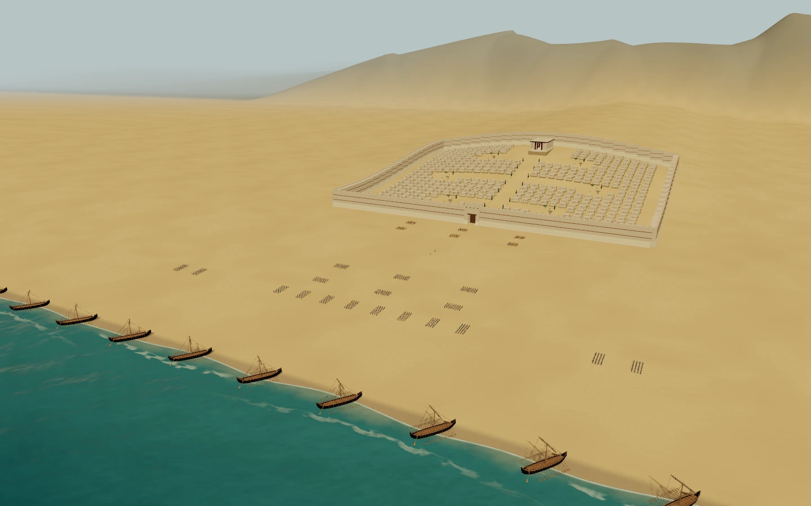
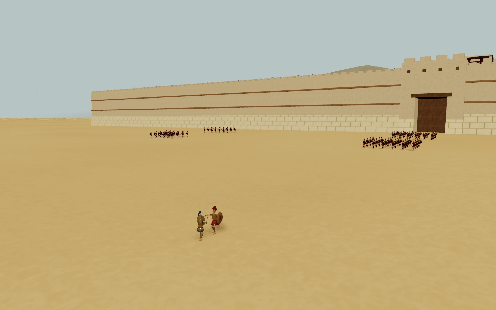

# Kiln

[](https://github.com/instruktlabs/kiln/actions/workflows/ci.yml)
[](https://www.npmjs.com/package/@instruktlabs/kiln)
[](LICENSE)

**Build and revise 3D assets with your coding agent.**

Your agent writes JavaScript using Kiln's geometry and material helpers. Kiln runs
the program, returns rendered views and structural checks, and exports a GLB.
Keep the editable source to refine the asset later.

Kiln runs locally through MCP, the CLI or a JavaScript/TypeScript SDK. It is free,
open source and account-free. Your coding agent supplies the model; Kiln's tools
do not require a separate model API key.

[Documentation](https://kilnstudio.tools/docs/install/) ·
[Gallery](https://kilnstudio.tools/gallery/) ·
[Interactive scenes](https://kilnstudio.tools/scenes/) ·
[Changelog](CHANGELOG.md)

| Troy: the city and fleet | Achilles and Hector at the gates |
| --- | --- |
| [](https://kilnstudio.tools/scenes/troy/) | [](https://kilnstudio.tools/scenes/troy/) |

Play [Troy](https://kilnstudio.tools/scenes/troy/), explore the
[Farm](https://kilnstudio.tools/scenes/farm/), drive across
[Golden Gate](https://kilnstudio.tools/scenes/golden-gate/), or walk the
[Foundry Floor](https://kilnstudio.tools/scenes/foundry-floor/).
The scenes combine Kiln assets with application code; their [source](scenes/README.md)
and [asset packs](packs/README.md) are available separately.

## Install

Use Node.js 22 or 24 LTS and npm. See [supported versions and platforms](docs/install.md)
for the complete compatibility range. Bun is only needed to work on Kiln itself.

```sh
mkdir kiln-install
cd kiln-install
npm init -y
npm install @instruktlabs/kiln
npm exec --offline -- kiln-init ../my-assets --harness codex
cd ../my-assets
```

Open your coding agent in `my-assets` and follow `START.md`. Choose `claude`,
`codex`, `opencode`, `agy`, `hermes`, `copilot` or `cursor-agent` for `--harness`.
Setup creates project-local instructions, skills, launchers and a `kiln_workspace`
MCP connection. Keep this authoring workspace separate from the engine installation.

Then ask your agent for an asset:

> Create a low-poly camping lantern with a carry handle. Review it from several
> angles, refine any problems, and save the editable source and a GLB.

For an **existing project**, Kiln 1.1+ supports a preview followed by adoption:

```sh
# Run from kiln-install; replace the path and harness for your project.
npm exec --offline -- kiln-init /absolute/path/to/my-project --adopt --harness codex --check
npm exec --offline -- kiln-init /absolute/path/to/my-project --adopt --harness codex
```

The preview writes nothing and exits 1 when changes are needed. Adoption preserves
existing instructions and unrelated configuration, and reports conflicts before
overwriting files. See [installation and upgrades](docs/install.md) for version
availability, additional agents, repairs and plugin setup.

## What you can do

| Task | Kiln provides |
| --- | --- |
| Author and refine | Geometry helpers, named parts, immutable source revisions and anchored edits |
| Inspect | Multi-view renders, measurements and image-independent structural QA |
| Save and reuse | A local asset library, revision history and portable source/GLB exports |
| Review together | A local dashboard with materials, optional projects and Live Review |
| Integrate | Shared CLI/MCP tools and compiled ESM with TypeScript declarations |

Projects are optional. A single asset needs no pack, project record or hosted account.
Use [Discovery](docs/tools.md) to find helpers rather than guessing API names.

CPU rendering works without a GPU and is useful for geometry review. Material-faithful
views use the optional local render service; texture and metallic appearance must be
checked against the reported fidelity. See [rendering and materials](docs/rendering.md).
Experimental implicit modeling and the alternative Three.js exporter are opt-in;
their [stability boundaries](docs/sdk.md#stability-in-1x) are documented separately.

## CLI and SDK

The package installs three commands: `kiln`, `kiln-init` and `kiln-mcp`.
Inside a generated workspace, the launcher uses that workspace's installation and stores:

```sh
node kiln.mjs discover --capabilities --json
node kiln.mjs render my-asset.kiln.js --out my-asset.glb --views sheet.png
node kiln.mjs view
```

The SDK is available as `@instruktlabs/kiln` and documented subpaths.
Read the [SDK guide](docs/sdk.md) for imports and host interfaces, and the
[tool reference](docs/tools.md) for MCP schemas. Local Claude Code and Codex
[plugins](docs/install.md#local-claude-code-and-codex-plugins) use the same workspace
setup. Other MCP clients can connect directly.

[ChatGPT](docs/chatgpt.md) uses a separate remote-connection setup. A public hosted
Kiln service and vendor directory listings are not available yet.

## Work on Kiln

For engine development, use the [pinned toolchain](toolchain.json):

```sh
git clone --filter=blob:none https://github.com/instruktlabs/kiln
cd kiln
bun install --frozen-lockfile
bun run build:sdk
node scripts/example-archive.mjs --fetch
bun run typecheck
bun run test
```

Read [CONTRIBUTING.md](CONTRIBUTING.md) for the complete checks, package builds and
bug-report guidance, and [AGENTS.md](AGENTS.md) when changing the engine with an agent.
Author assets in a separate workspace. Large scene downloads are optional and are
not fetched by cloning the repository.

Kiln is maintained by [Instrukt Labs](https://github.com/instruktlabs) and released
under the [MIT license](LICENSE). Downloaded asset packs carry their own licenses.
