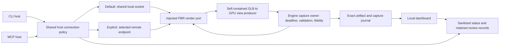

# GPU service integration review, 2026-09-26

Status: diagnosis and regression proof. No renderer, authentication, lifecycle or credential configuration changes were made in this review.

Measurement condition: all performance observations in this session were collected under uncontrolled concurrent agent and workstation load. Timings are diagnostic observations, not isolated baselines, capacity estimates, or comparative performance acceptance. Repeat any performance conclusion on the named machine with controlled workload and recorded process/renderer identity.

## Confirmed finding

The material qualification script bypassed the established host resolver. It called `startLocalRenderService()` and then `makeRemoteRenderPort(url, process.env.KILN_RENDER_TOKEN)`. The service required authentication, the process had a local `RENDER_SERVICE_TOKEN`, and it had no `KILN_RENDER_TOKEN`. The raw transport correctly rejected the missing credential before uploading the GLB. Joining a compatible service only establishes its identity, not authorization to render.

The supported host path already handles this configuration: `buildRenderPort` selects `KILN_RENDER_TOKEN ?? RENDER_SERVICE_TOKEN` for automatic local routing, but only `KILN_RENDER_TOKEN` for an explicitly selected endpoint. See [host credential selection](../../src/cli-render-mode.ts#L140), [remote isolation](../../src/cli-render-mode.ts#L192), and [missing-credential check](../../src/render-service-client.ts#L170). An explicit loopback URL still means explicit endpoint selection. Inferring credential authority from a URL's hostname would weaken this boundary.

Do not add an ambient local-token fallback to `makeRemoteRenderPort`. It is an explicit transport primitive and may be passed an arbitrary remote URL. Use the existing host resolver in local qualification scripts, CLI, MCP and future dashboard integrations.

## Controlled reproduction

One existing renderer was observed before, between and after two calls. No service was started, stopped or replaced, and no environment setting was changed. No credential value was printed or retained.

| Evidence | Value |
| --- | --- |
| UTC interval | `2026-09-26T23:56:52.059Z` to `2026-09-26T23:56:53.531Z` |
| Runtime | Bun `1.4.2` |
| Endpoint | `http://127.0.0.1:8000` |
| Service PID / start | `28720` / `2026-09-26T23:53:30.814Z` |
| Capture instance, all three probes | `610a1f8d-0208-454a-863f-27c08cdbfb4a` |
| Source fingerprint, all three probes | `sha256:09b81bf9c8f3570273e00a986c5607d040e5c4240f2201d0fad9616663cf7ba8` |
| Credential evidence | Local token present; remote token absent; health says authentication required |
| Raw transport | `requires authentication; configure KILN_RENDER_TOKEN...` |
| Shared resolver | `buildRenderPort('auto', undefined, {autoSpawn:false})`: one successful 128 px view, material-faithful derivative receipt |
| Actual renderer | `dawn-d3d12:nvidia-geforce-rtx-3070:D3D12 driver version 32.0.16.1074` |

Input was the checked-in `render-service/test/fixtures/material-channels-v1.glb`, with one view from `[1,1,1]`. The successful shared resolver call used the already listening service only. This confirms that credential selection alone is sufficient to reproduce the failure and success against the same instance.

The first two qualification attempts did not retain their exact timestamp or health identity; their failure receipts were overwritten by the eventual successful receipt. Therefore those historical runs cannot establish which process owned the endpoint at the time. Concurrent Claude agents, a service takeover, or a default-port test collision are **not supported explanations** for the observed authentication message. This reproduction does not claim they can never happen; it eliminates a need to invoke them to explain this failure.

## Existing architecture and verified boundaries

- The socket is the registry. [Startup](../../src/render-service-host.ts#L190) adopts only verified current service identity; absent, unknown, foreign and incompatible listeners remain distinct. It does not replace a listener because its initiating host exited.
- [Lazy local recovery](../../src/cli-render-mode.ts#L32) coalesces concurrent requests within a host, retries startup only after a refused socket, and does not restart for an authentication rejection or unknown listener. Credentials and route are captured when the host is created.
- [Explicit stop](../../src/render-service-host.ts#L149) rechecks local PID, start time, instance and compatibility. Owner PID is provenance, not authority over other users.
- Managed lifetime follows admitted uploads, queued jobs and active GPU work; health requests alone do not keep the service alive. [Real HTTP tests with simulated GPU work](../../render-service/test/hardening.test.mjs#L400) cover disconnects, initiating-owner death, pending work, overload and idle exit. These are lifecycle evidence, not hardware-rendering acceptance.
- Health is deliberately readable without rendering authorization. [Capabilities](../../src/render-capabilities.ts#L93) already distinguish `missing`, `configured-unverified`, and `not-required`. Health with a configured token must not be called authenticated; only an authorized operation verifies access.
- The focused host/lifecycle/auth tests inspected here bind ephemeral ports or select an ephemeral port before local discovery. The HTTP handler fixture overrides `PORT` and empties its child service token. They do not intentionally borrow the workstation's port 8000. Process environment changes are restored by their tests or confined to spawned children. This is a bounded source review, not a claim that every test and every external harness is immune to environment races.

## Remaining risks to qualify

1. **Cross-process cold starts.** The [concurrent-start fixture](../../src/__tests__/render-service-lifecycle.test.ts#L139) uses two calls from one process and a simulated service. Separate CLI/MCP hosts still race to launch. The real service initializes GPU/native resources before binding its socket, so simultaneous starters can temporarily initialize several GPU processes before one wins the port. A losing child can also exit while a winner is still becoming healthy. The focused review first reproduced Windows fixture teardown failure `EBUSY` with a surviving test-owned fake renderer; the subsequent isolated experiment established the ordering in two natural runs without injected delay. On ephemeral port 51692, both host calls returned at 2026-09-27 00:09:55.010/.011 UTC, teardown stopped winner PID 28612 by .029, and late PID 26404 acquired the vacated socket at .056. Port 54259 reproduced the same ordering with different processes. Each host had already launched a Windows helper, but both polling loops accepted the first healthy service before the second helper finished launching its child. Teardown owned only the first PID. The fake service advertises managed lifetime without implementing the real idle timer, allowing that late child to persist and lock its working directory. All experimental children were verified and stopped; port 8000 and GPU hardware were untouched. This proves the fixture cleanup mechanism and pending-launch window, not indefinite production lifetime or the cause of the separate authentication rejection. The fixture now gates health until both child PIDs are recorded and owns both for teardown. Production behavior is unchanged. Qualify separate-host startup with compatible authenticated fixtures and opt-in hardware before changing architecture. Do not introduce a second registry or terminate an unknown listener as a shortcut.
2. **Identity across a health/render interval.** The client verifies full health before each render, and capture cache identity includes the service instance. The render response is compared to `rendererId`, not the complete service instance. A same-device restart between health and render can therefore leave instance attribution ambiguous. If exact service-instance provenance is needed, version the render receipt to echo verified instance/build identity and reject a mismatch. Preserve the successful GLB/input hash and image evidence already returned.
3. **Historical attribution.** Qualification runs must append a receipt per attempt, including UTC timestamp, sanitized route, health instance/build, selected credential source category, and outcome code. Keeping only the final success makes intermittent integration defects unnecessarily hard to diagnose.
4. **Configuration changes.** Existing hosts intentionally retain their route and credential selection. Reprobe refreshes readiness, not credentials or loaded build. A token rotation or changed endpoint requires a new host context; the dashboard should make that consequence visible instead of silently retrying with ambient values.

## Proposed integration, before further architecture changes

Local development is the primary workflow; remote rendering is an explicit extension. Use one host-level connection resolver for CLI, MCP, dashboard and qualification code. `buildRenderPort` already supplies most of that policy, but its CLI naming and separately repeated environment interpretation make bypassing it easy. Consolidate this existing implementation into a shared host boundary rather than adding another adapter or fallback layer. Keep the lower-level remote transport explicit. Do not require a renderer restart, new token, extra port, or per-agent daemon to solve this incident.

The diagram is the proposed host integration boundary, not a new network dependency inside deterministic evaluation. The browser's interactive GPU viewport is separate from stored GPU service captures. An image's color or apparent detail does not identify its producer; use the retained renderer and fidelity receipt. CPU grid composition or PNG encoding also does not mean its underlying shaded views were CPU rendered.

The target configuration is a discriminated connection choice, resolved once at host startup:

- `local`: shared loopback socket, optional selected port and local service credential, compatible automatic join/start, managed idle lifecycle. No remote endpoint is consulted.
- `remote`: explicitly selected URL and explicitly scoped client credential, compatible identity check, no local discovery/start/stop or automatic route substitution.

This configuration concerns host connectivity, not editable project design, asset source or the deterministic engine. CLI flags, harness environment and the packaged dashboard must resolve through the same implementation; the dashboard must not maintain a second renderer configuration. A host-injected port remains a supported embedding contract, rather than another ambient configuration source.

There is a real ambiguity to remove deliberately: today's local rule gives global `KILN_RENDER_TOKEN` precedence over `RENDER_SERVICE_TOKEN`. If a user retains a token for an occasional remote endpoint while running a locally authenticated renderer with another token, local rendering receives the remote credential and fails with HTTP 401. Existing tests intentionally preserve this precedence, so reversing it silently is a compatibility change, not a correction to the incident. The clean target associates a credential with its selected connection: local uses explicit local configuration or its inherited service credential; remote uses its explicit client configuration. Migrate and document legacy environment interpretation at the one startup boundary, with a clear ambiguity diagnostic where both credentials conflict. Do not try both tokens in sequence, copy local tokens to remote routes, or add permanent nested fallback rules.

GPU selection and connection selection should be separate host decisions. Preserve `cpu` as an explicit diagnostic/offline mode. Required GPU qualification must request GPU for every requested image and fail clearly when it cannot produce that image; a CPU image cannot pass GPU or material acceptance. In the current working source, `buildRenderPort('gpu')` already sets `viewRenderRequired`, the [main review grid](../../src/tools/registry.ts#L1346) dispatches when `neededPbr || viewRenderRequired`, and [failure throws before CPU substitution](../../src/tools/registry.ts#L1390). Therefore a colored cube taking the CPU route under explicit GPU mode needs an exact built-runtime/entry-point reproduction before it is attributed to the current main-grid source.

For the local-first live-review experience, propose one explicit host render preference shared by main grids, animation, interior/inspection derivatives, and final artifact views: GPU-preferred for normal interactive observation, GPU-required for qualification, CPU-explicit for offline/diagnostic use. Decide and document whether the current `auto` flag becomes GPU-preferred for all images; today its main-grid optimization can intentionally use CPU for untextured nonmetallic geometry. This is a user-visible policy change and should be qualified, not hidden in a material-type heuristic. Keep tool input schemas stable. All preferences must call the existing capture owner for deadline, cancellation, PNG validation and degradation; they must not implement separate retries or fallback renderers. Image-free validation and QA remain image-free.

Expose a sanitized typed diagnostic alongside existing human-readable reasons: route (`local`, `explicit-remote`, `cpu`), endpoint origin, credential source (`none`, `client-config`, `local-service-config`), auth state (`missing`, `configured-unverified`, `verified-for-instance`, `rejected`), probe state, instance/build identity, and last operation outcome/time. Never expose token values, URL userinfo, or query strings. Successful access evidence belongs to the particular instance and expires on identity change. Keep passive health inspection read-only; a dashboard must not render merely to show its status.

Before shipping such an additive diagnostic contract, qualify: four independent hosts sharing one authenticated fake service; host exit during another client's active work; wrong credentials with no restart; unknown listener with no replacement; managed idle expiry and one resumed local route; fresh capture identity after restart; explicit remote isolation even for loopback; and environment changes after host creation. Existing coverage already supplies pieces of this matrix and should be extended rather than replaced.

For the demonstrated pending-launch window, an in-flight promise can coalesce starts within one host but cannot solve independent hosts. A candidate architecture to investigate is a versioned `starting` state on the existing bound socket before expensive native/GPU initialization. Compatible clients could join and wait for explicit readiness while that socket remains the only registry. This requires deliberate protocol, authentication, cancellation and hardware qualification. It is a proposal, not an implemented fix. Workstation CPU/GPU activity from concurrent projects contaminates performance measurements; the recorded timestamps establish event order only and must not become latency baselines or performance acceptance claims.

## Regression proof added

[renderer-auth-integration.test.ts](../../src/__tests__/renderer-auth-integration.test.ts) compares the mistaken raw client, the normal automatic-local resolver and an explicit endpoint against **one authenticated ephemeral fixture and unchanged health identity**. It asserts no upload when credentials are absent, successful local fallback, accurate health-only auth reporting, and no local-token leakage to an explicit endpoint. It restores all environment settings it touches and does not start or stop the machine's renderer.

Focused result: `bun test src/__tests__/renderer-auth-integration.test.ts --timeout 20000`: **1 passed, 9 assertions**. This is added regression evidence for existing correct policy, not a production behavior change or a new rendering acceptance claim.

Broader renderer slice: **30 passed, 1 failed, 96 assertions** across the new proof plus CLI mode, lifecycle and hardening suites. The failure was the existing concurrent cold-start fixture cleanup described above, not the new authentication regression. Scoped Biome passed. Full release acceptance remains outside this review.

Subsequent fixture correction: the new [startup-gate regression](../../src/__tests__/render-service-fixture-lifecycle.test.ts) first failed because the old fake service exposed health without announcing ownership. The optional test-only startup journal/gate then made the new proof plus lifecycle suite pass: **9 tests, 32 assertions**. The concurrent-start case additionally passed **four repeated runs, 16 assertions**. Scoped Biome and repository typecheck passed after this change. No production renderer, authentication or lifecycle implementation was edited. These results supersede the fixture-cleanup failure in the earlier slice, but do not replace a full integrated validation run.
