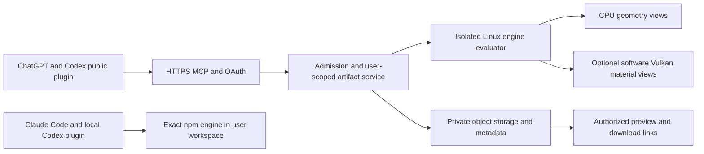
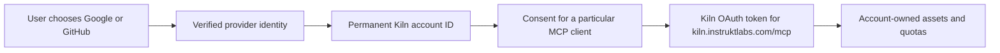

# Kiln Engine 1.0 publication plan

Research dates: 5-6 October 2026. Repository audited at
`cf4abe6c7b142da56d005751e21d0f9c57a9dd21`.
Plan updated: 6 October 2026, including release sequencing, ownership, hosting economics and decision handling.

Execution checkpoint, 7 October: stable `@instruktlabs/kiln@1.0.0` and the GitHub
release are public. The goal is active. Shared project setup is being qualified;
public hosting and directory submissions remain unfinished. See the
[current status and PR sequence](../reviews/2026-10-07-release-status.md).
The research and earlier setup observations below retain their original context.

Status: documented v1 plan, with owner decisions recorded in section 9 and remaining
choices proposed for review. This document records research and planned work;
the document itself does not authorize a repository transfer, account creation, paid deployment,
package publication or directory submission. No engine implementation or package
publication was performed during this audit. The owner separately authorized the
private Sites probe on 6 October; its local and hosted results are recorded below.
Later on 6 October the owner explicitly authorized doing the GitHub transfer and
npm onboarding immediately. The native transfer to `instruktlabs/kiln` completed;
community/history preservation passed comparison and the local origin was updated.
The owner-approved exact Bun action was added to the inherited Actions allowlist;
a Linux CI job rerun passed under the new ownership. See the
[setup receipt](../reviews/2026-10-06-publisher-setup.md). npm personal
account creation and email verification are complete, and the free `instruktlabs`
organization is registered with `matthew-kissinger` as owner. Two security keys,
write-action 2FA and organization-wide 2FA enforcement are verified. The owner also
explicitly authorized Workers Paid if needed; the signed-in dashboard confirms
Workers Paid and R2 Paid are already active, so no purchase was needed. These setup
actions do not activate the full implementation goal or publish a package.
The owner has set the next publication target to **1.0**.
Older references to a separate 0.11 release remain historical until the maintained
roadmap and release documents are aligned during implementation.

## Goal statement

Deliver Kiln Engine 1.0 as a verified public npm package with a supported SDK, CLI,
local MCP server and installable Claude Code/Codex plugins; qualify and launch an
affordable authenticated hosted MCP service for ChatGPT/Codex; and submit complete,
tested candidates to the OpenAI and Anthropic plugin directories. Publish under
Instrukt Labs as `@instruktlabs/kiln` under the secured npm organization; preserve
existing workspaces and contributor history,
and keep outside issue/PR triage out of this cycle. Develop integrations alongside
package readiness, publish the package when its own gates pass, and track vendor
approval separately from the work the maintainer can complete.

Include publisher onboarding and release automation in the goal: establish the npm
account/organization, configure trusted publishing, and verify the resulting release
path. The agent carries technical preparation and routine setup through completion;
the owner handles private authentication, identity verification and the concrete
publication approvals still required. Sequence these handoffs when actionable and
continue independent implementation while awaiting them. The owner requested this
division of work on 6 October; adding it to the goal statement does not start execution.

The owner selected `@instruktlabs/kiln` and an early GitHub transfer on 6 October,
with preservation of stars and open PRs as an explicit condition. The goal statement
describes the intended development-cycle outcome; this documentation update does
not itself perform implementation, a transfer or external release actions.

The owner requested a ready-to-start overnight execution goal on 6 October. Its
copyable text is in [the execution goal](2026-10-06-v1-execution-goal.md). Perform the
remaining transfer closeout and npm onboarding first while the owner can observe and respond.
Surface account handoffs in both the visible browser and chat, with decisions
sequenced through the question tool. This is a requested execution order and target,
not evidence that the full plan can finish in one night; see section 7. The goal has
not been activated by this documentation request.

### Confirmed direction and proposed choices

The owner has confirmed the 1.0 release target, Instrukt Labs organization/LLC
ownership, exclusion of incoming community issue/PR work before publication, and
permission for the bounded private Sites probe. The owner selected the npm name
`@instruktlabs/kiln` and an early GitHub move with community history preserved. The
owner has also invited decisions to be surfaced now or through questions while work
proceeds. On 6 October the owner clarified that **$20/month is an initial target,
not a hard ceiling**: optimize cost and allow deliberate growth, avoiding sustained
hundreds of dollars without funding. The owner has Cloudflare and ChatGPT Pro and
is open to sponsorships/credits. The owner also selected retention of saved assets until
deleted within a storage quota, with unsaved work expiring after seven days. The
owner selected an all-Cloudflare production stack on 6 October, permits a bounded
Sites probe, and wants another provider considered only for a demonstrated cost,
performance, capacity or compatibility reason. Exact quotas and production
qualification remain open. The owner selected `kiln.instruktlabs.com` for the
hosted service and its MCP/support/privacy pages on 6 October. Record
explicit answers in section 9 rather than treating a
recommendation or an unanswered question as acceptance.
After reviewing the concrete inventory and MCP exposure on 6 October, the owner
accepted retaining existing experimental functionality, making its labels and
limitations consistently visible, documenting stable APIs separately, and keeping
the alternative exporter explicitly selected. Any change to feature availability
or defaults still needs its own evidence and review.

## 1. Recommended release

Publish **Kiln Engine**, maintained by **Instrukt Labs**, as **`@instruktlabs/kiln`**
under the now-registered npm organization. Keep the `kiln` CLI and the product name.
Use one versioned engine package, thin integration packages, and a hosted service
running the same qualified engine artifact. Do not split the engine into a new
multi-package architecture merely to publish it.

The cycle should deliver:

1. A public npm `1.0.0` with a defined JavaScript/TypeScript SDK, CLI, workspace setup,
   local MCP server, maintained skills and migration instructions.
2. Working local plugins for Claude Code and Codex, installable without cloning or
   building the engine repository.
3. A small hosted Kiln service supporting a public OpenAI plugin for ChatGPT and
   Codex, with authentication, isolated evaluation, persistent private artifacts,
   reliable downloads and bounded operating cost.
4. Submitted OpenAI and Anthropic directory candidates, each with reproducible
   installation and end-to-end evidence. Directory acceptance is an external
   milestone; do not promise approval within the development cycle.

Retain the CPU rasterizer. Qualify the existing software Vulkan path for material
previews before considering rented GPUs or a new software renderer. Keep optional
Strands/provider execution out of the hosted baseline: the user's agent authors the
source and Kiln evaluates it, so normal MCP operation does not require Kiln-funded
model inference.

The owner explicitly excluded outside issues and PRs from this pre-v1 scope. Existing
contributions should remain intact and receive a separate triage cycle. New packs,
Troy features, whole-game performance work and a commercial Studio application are
also outside this publication cycle.

## 2. Publisher, package name and repository ownership

### Initial read-only namespace findings, before registration

Public registry and profile checks were read-only. A missing package or scope is a
point-in-time signal, not a reservation or a guarantee that registration will succeed.

| Name | Observed result | Recommendation |
| --- | --- | --- |
| `kiln` | Published package, latest `0.0.1`, belonging to another maintainer | Unavailable |
| `@kiln/engine` | Package missing; `kiln` npm scope exists; owner confirms it is someone else's | Blocked by scope ownership |
| `@instruktlabs/kiln` | Package 404; npm organization page says `Scope not found` | First choice |
| `@instruktlabs/kiln-engine` | Package 404; same scope result | More explicit fallback within the chosen scope |
| `@instruktlabs/engine` | Package 404; same scope result | Too generic for an organization with multiple products |
| `@kilnstudio/engine` | Package 404; npm scope page says `Scope not found` | Viable alternative, but requires another brand namespace |
| `kiln-engine` | Package 404 | Unscoped fallback; less useful for organization governance |
| `@kiln3d/engine` | Package missing, but `kiln3d` account exists | Avoid: closely adjacent naming collision |

The existing [Kiln3D npm package](https://www.npmjs.com/package/kiln3d) describes a
Kiln MCP server for AI-assisted 3D printing, with a
[separate repository](https://github.com/codeofaxel/Kiln). This makes the publisher
qualification useful: **Kiln Engine by Instrukt Labs**, with a clear description of
procedural 3D asset authoring. npm checks do not establish trademark clearance.

The verified GitHub organization is [instruktlabs](https://github.com/instruktlabs),
display name **Instrukt Labs**, with one public repository,
[matter-field](https://github.com/instruktlabs/matter-field). The owner states that
Instrukt Labs is also the LLC name. Use the exact legal entity details during vendor
verification, subject to the owner's confirmation of the account information.

### npm ownership is independent of GitHub ownership

GitHub organization ownership does not reserve the same npm scope. Create an npm
organization separately and give the release workflow publishing access. Public npm
organizations are free. `@instruktlabs/kiln` can be published from the existing
`matthew-kissinger/kiln` repository; the npm scope and GitHub owner do not need to
match. Configure trusted publishing for the repository that actually runs the workflow.
See [npm organizations](https://docs.npmjs.com/organizations/),
[organization creation](https://docs.npmjs.com/creating-an-organization/) and
[trusted publishing](https://docs.npmjs.com/trusted-publishers/).

Owner-selected community destination: **`instruktlabs/kiln`**. Transfer early in the
cycle, before creating final publishing trust and directory bindings, subject to the
owner's condition that stars, open PRs and existing community history are preserved.
A transfer preserves issues, PRs, stars and Git history and redirects repository URLs.
It does not require reviewing or merging incoming PRs. GitHub Pages URLs are a
separate concern. See [GitHub's transfer documentation](https://docs.github.com/en/repositories/creating-and-managing-repositories/transferring-a-repository).

Personal portfolio visibility is compatible with organization ownership. GitHub
allows a public repository to be pinned on a personal profile when the user owns it
or has contributed within the preceding year. The owner's recent Kiln contributions
qualify; verify the personal pin after transfer and optionally feature the same repo
on the organization profile. Keep the original history and attribution. See
[GitHub's profile reference](https://docs.github.com/en/account-and-profile/reference/profile-reference).

### Transfer verification, checked 6 October 2026

GitHub's current transfer documentation confirms preservation of stars, watchers,
issues, PRs, wiki, commit contributions and fork relationships. Existing collaborators,
webhooks, secrets and deploy keys remain associated. Caveats to check:

- Issue assignees outside the destination organization are cleared.
- Destination organization permissions and policies apply.
- Repository/Git URLs redirect; GitHub Pages URLs do not.
- Reusing the old repository path removes its redirects.
- Private repositories moving to a Free account can lose plan-dependent features;
  Kiln is currently public.

Source: [GitHub repository transfer documentation](https://docs.github.com/en/repositories/creating-and-managing-repositories/transferring-a-repository).

The read-only GitHub API check found repository ID `1278326592`, public and not a
fork, with **233 stars, 18 forks, two subscribers, three open PRs (#140, #141, #142)
and one open issue (#134)**. The PRs have no assignees; issue #134 is assigned to
`matthew-kissinger`. GitHub Pages is not enabled. The destination organization lists
only `matter-field`, so no `kiln` name conflict was observed. These are planning
observations, not the final transfer baseline; refresh them immediately before the
move and verify organization membership for any issue assignees.

### Transfer acceptance

The transfer work item must inventory and verify: required checks/rules, Actions
permissions, deployment integration installations, source URLs, badges, local remotes,
release links, Pages/custom-domain behavior, npm provenance bindings and plugin
repository references. Do not recreate a repository at the old path and break the
redirect. If the transfer is deferred, proceed with npm publication from the current
repository; it is not a package blocker.

Use GitHub's native repository transfer for the existing repository. Before the move,
record its immutable repository ID, star/watch/fork counts, release/tag inventory,
and a paginated inventory of open issues and PRs, including numbers, titles, authors,
states, assignees and PR branch references. Identify affected issue assignments before
the move and surface any owner decision needed to preserve them; do not silently
invite collaborators or change membership. After the move, verify the same repository ID,
preserved history/releases, every open issue/PR and its discussion, repository URL
redirects, and the personal profile pin. Compare community counts and reconcile any
concurrent activity; unexplained loss blocks transfer closeout. Do not close, merge,
recreate or triage outside PRs as part of this work. If transfer prerequisites cannot
preserve the existing repository, surface that before proceeding. A copied/new repo
does not satisfy this condition.

### Transfer executed on 6 October 2026

The owner explicitly requested immediate transfer and npm setup. GitHub's native
transfer API moved the existing repository to `instruktlabs/kiln`. Repository ID
`1278326592` and node ID `R_kgDOTDG3QA` are unchanged. The complete comparison retained
233 stargazer identities, two watchers, 18 fork identities, all 144 issue/PR records
(143 PRs, including the three open contributions), eight issue comments, open-PR
reviews, five releases/assets and tags, the main SHA, protected checks, collaborator
access, environment configuration and the personal pinned repository. Issue #134's
assignment remains intact. No contributor work was closed, merged or rewritten.

The old repository, issue #134, PR #140 and v0.10.0 release URLs redirect to the new
owner; Git access through the old URL still resolves the same refs. The local
`origin` now points to `https://github.com/instruktlabs/kiln.git`. The destination
was shown in the browser. Initial stargazer/watcher API propagation returned 404;
the subsequent complete snapshot succeeded with no errors and exact identity matches.

Evidence is stored outside the distributable engine checkout at
`C:/Users/Mattm/X/kiln-dogfood/publisher-setup-2026-10-06/`: `before.json`, `after.json`
and `comparison.json`. Repository content references and plugin publishing bindings
remain part of the implementation cycle; old URLs currently redirect.

One organization-policy difference was resolved with explicit owner approval: Instrukt Labs
requires full SHA pins and allows only GitHub-owned Actions. Existing Kiln workflows
also use `oven-sh/setup-bun@0c5077e51419868618aeaa5fe8019c62421857d6`. A proposed
allowlist payload now permits only that existing version, retaining SHA enforcement
and other restrictions. The owner approved the organization-wide entry; the effective
repository policy was verified. The existing Linux CI job rerun passed under the new
ownership; its result is recorded in the setup receipt.

Use npm teams and protected release access for maintainers. Keep MIT licensing and
existing contributor attribution. Organization ownership is not permission to
retroactively reassign contributors' copyright. Add a short maintenance policy and a
security reporting route, without introducing a CLA or governance bureaucracy as a
release prerequisite.

## 3. Repository readiness: what exists and what blocks publication

The repository already has substantial release infrastructure. This is principally a
distribution and hosted-product cycle, not an engine rewrite.

| Surface | Current evidence | Required v1 disposition |
| --- | --- | --- |
| Release baseline | GitHub `v0.10.0` has a built tarball, checksums and platform receipts | Publish npm separately; incorporate main-only breaking changes into v1 migration notes |
| Current CI | [Run 37409744200](https://github.com/matthew-kissinger/kiln/actions/runs/37409744200) passed on the audited SHA | Rerun against the exact renamed/versioned candidate |
| Package identity | `@kiln/engine`, `private: true`, version `0.10.0` | Adopt owned name, public metadata/access and unique RC/final versions |
| CLI and MCP | Compiled Node bundles; lazy MCP engine loading; portable package tests | Preserve these strengths; add an explicit `kiln-mcp` executable |
| SDK | 55 export entries all target TypeScript; root export is `src/cli.ts` | Define the supported SDK and emit runnable ESM plus declarations |
| Tarball | Dry run: 829 files, 9,362,192 bytes compressed, 26,535,869 unpacked | Reduce historical documentation and verify the shipped allowlist |
| Docs payload | 440 files, 8,102,226 bytes under `docs/` | Ship consumer documentation and skill references; keep historical records on GitHub |
| Plugin setup | Claude, Codex and root manifests exist | Generate current host-specific packages from maintained skills and shared tool definitions |
| OpenAI ZIP | Packaging script emits `apps: './.app.json'` and a private connector binding | Replace for public submission; current public rules reject this format |
| ChatGPT UI/download | Interactive card previously worked; native GLB/ZIP attachments explicitly unverified | Prove actual HTTPS downloads and target-host behavior |
| Hosting | Local stdio, tunnel documentation and isolated evaluator building blocks | Implement public HTTP host, auth, tenancy, persistence and operational limits |
| Rendering | CPU fallback and installed software Vulkan CI probe | Qualify software rendering as an explicit production mode |
| Notices/support | MIT, contributing guide and dependency notices exist; notices reflect older dependency pins | Refresh exact artifact inventory and add security/support/privacy material |

Audit checks performed:

- `npm pack --dry-run --json --ignore-scripts`: inspected package contents; did not publish.
- `node scripts/test-plugin-package.mjs`: passed the current packaging contract.
- `node scripts/check-skills.mjs`: passed for six skills and the two registered setup copies.
- `claude plugin validate . --strict`: passed the marketplace check.
- `claude plugin validate .claude-plugin/plugin.json --strict`: failed on the warning
  that root `CLAUDE.md` is not loaded as plugin context. A passing marketplace check
  does not establish plugin readiness.
- Plain Node 24 import of `@kiln/engine/discovery` failed with `ERR_MODULE_NOT_FOUND`
  on the extensionless `src/discovery/catalog` import. Current documentation requires
  a TS-aware loader/bundler; ordinary Node SDK support is not established.
- Inspected the completed CI platform jobs, including installed software Vulkan.
  The full local test suite was not rerun for this research-only document.

The current shell has Node 24.20.0/npm 11.19.0; repository maintainer pins are Node
22.23.3/npm 12.2.0/Bun 1.4.2. Release gates must use the pins. Consumer support is a
separate decision: Node 20 is now EOL, while 22 and 24 are LTS in the
[current Node schedule](https://nodejs.org/en/about/previous-releases). Recommend
supporting maintained 22/24 lines for v1, with the tested minimum declared in
`src/runtime-support.mjs` and `engines.node`. Do not impose Bun or the publishing npm
version on consumers.

## 4. npm and SDK work

### Package contract

Keep a single `@instruktlabs/kiln` engine package for v1. Classify every current export
as stable, explicitly experimental, or internal before freezing semver. Start the
stable contract from documented consumer use: authoring primitives/helpers, rendering,
validation, discovery and the APIs needed by CLI/MCP hosts. Do not promise all 55
subpaths indefinitely without reviewing their dependencies and callers.

Emit compiled ESM with valid relative extensions and `.d.ts` declarations. Give root
imports a deliberate library entry without CLI execution. Preserve documented source
workflows through an explicit migration path. Separate Node-only entrypoints from
portable ones and qualify any browser claims. In particular, avoid pulling
`src/views/renderer-id.ts` and its module-load filesystem access into portable imports.
CommonJS support is not required without an actual consumer need.

#### SDK decision evidence, checked 6 October

The 55 current export entries in [package.json](../../package.json) point to
TypeScript source, with the root pointing at the CLI. The maintained
[architecture reference](../architecture.md) documents tools, the optional agent,
discovery, requirements, rendering/views, geometry, immutable stores, caches,
contracts, composition, QA and arena APIs. This is an existing consumer surface;
optional agent/arena/composition modules are not automatically experimental.

The architecture reference explicitly labels `/implicit` experimental, and the
Discovery catalog already carries stable/experimental/deprecated metadata for
individual helpers and recipes. Recommend preserving established documented
features, carrying existing experimental labels and limitations into the package,
and reviewing all exported contracts before freezing v1. Do not relabel established
APIs merely to avoid supporting them. If that review exposes a consequential removal
or behavior change, present the specific callers and migration before adopting it.
On 6 October the owner accepted the specific experimental-feature policy after
reviewing the inventory and actual MCP exposure below: retain existing functionality,
make labels/limitations visible, document stable APIs separately, preserve explicit
exporter selection, and review availability/default changes individually. State the
stability promise in consumer documentation. Experimental labeling does not waive
installation, export resolution, resource bounds or truthful fidelity checks.

#### What is currently experimental and how users encounter it

Follow-up inspection on 6 October used checkout
`65ce2f815a70ca3bdf8ad4fa1f8bf52d5fd08581`. The current Discovery catalog contains
137 entries: **one experimental operation and 16 experimental recipes**, alongside
120 stable entries. These labels do not classify the whole engine or MCP server as
experimental, and recipe labels do not downgrade the stable helpers they use.

| Existing item | Meaning and limitations | Current exposure |
| --- | --- | --- |
| `implicitSurface` | Samples a mathematical field into mesh geometry; resolution-dependent, no UVs, no guarantee of CAD accuracy or thin-feature preservation; host execution limits still required | Exported from `/implicit` and re-exported by `/primitives`; present in normal authoring globals used by `kiln_render`; no separate experimental opt-in |
| 16 construction/rig recipes | Teaching examples and modeling guidance with specific limitations, not complete anatomy, physics, contact, navigation or manufacturing solutions | Returned by the ordinary `kiln_discover` catalog/search/detail routes and the `/discovery` package entrypoint; recipes are not separate MCP tools |
| Alternative Three.js `GLTFExporter` backend | Export conversion candidate with native dependency, texture-transform and downstream qualification limits | Included but explicitly selected by host `KILN_GLTF_EXPORTER=three` or library `gltfExporter: 'three'`; default remains the established exporter |

The 16 recipe IDs are seven rig guides (`rig-biped-v1`, `rig-quadruped-v1`,
`rig-avian-v1`, `rig-serpentine-v1`, `rig-multi-limb-v1`, `rig-wheeled-v1`,
`rig-custom-v1`) and nine construction guides (`joined-frame-v1`,
`editable-assembly-v1`, `surface-detail-v1`, `foliage-cutout-v1`,
`directional-sweep-v1`, `structural-bays-v1`, `open-tiered-seating-v1`,
`steerable-wheel-v1`, `branched-articulation-v1`). Prefix each with `recipe:` for
exact Discovery lookup. For example, a rig recipe provides semantic joint guidance,
not skinning or a gait solver; its label is about the recipe's scope/readiness.

Confirmed model-facing routes:

```text
kiln_discover({ capabilities: true })
kiln_discover({ ids: ["implicitSurface"] })
kiln_discover({ ids: ["recipe:surface-detail-v1"] })
```

Capabilities report `geometry.implicitSurfaces: 'experimental'` and whether the
experimental exporter is selected. Exact helper/recipe details include
`stability: 'experimental'` and limitations. `implicitSurface` also stamps an
`EXPERIMENTAL_IMPLICIT_SURFACE` geometry warning that enters export warnings;
compact render replies may bound the warning list.

**Exposure gap to fix during implementation:** the Discovery service retains
`stability` in structured search results, but its compact search text omits that
field. MCP's Discovery adapter sends the text representation, so an experimental
recipe can appear in normal search without its experimental label until the agent
fetches exact details. The helper's own summary says experimental; most recipe
summaries do not. There is no general `includeExperimental` switch or stability
filter in the current Discovery input schema. Adding a new input flag would require
the normal schema/compatibility review, not an incidental packaging change.

A read-only probe against the actual Node stdio MCP bundle confirmed 17 tools with
no separate experimental tool; capabilities and exact details show the labels, while
`query: 'surface detail', kind: 'recipe'` did not show the label. The response had
text content and no `structuredContent`. The MCP/engine build identity matched the
current source identity (`sha256:58b1b1784701b3b04bac6e7a429ea5dd9d1aeac646e5189bbb21f251e9f1a295`).
Receipt: `C:/Users/Mattm/X/kiln-dogfood/experimental-mcp-probe-2026-10-06/discovery-receipt.json`.
This probe did not render an asset, invoke models or change runtime code.

Release work should make existing stability labels visible in compact Discovery
results, document the different meanings above, and preserve explicit exporter
selection. Review any proposal to hide helpers, remove recipes or change defaults
separately. An experimental label alone is not an execution restriction or a reason
to remove a working feature.

Evidence: [helper contract](../../src/discovery/helper-contracts.ts),
[recipe catalog](../../src/discovery/recipes.ts),
[Discovery presentation](../../src/discovery/service.ts),
[MCP formatting](../../src/mcp-engine.ts),
[capabilities](../../src/tools/discovery.ts),
[implicit implementation](../../src/implicit.ts), and
[exporter documentation](../community-exporter.md).

Add `repository`, `homepage`, `bugs`, public publishing configuration and typed export
metadata. Keep consumer installation free of engine-build and provider-login scripts.
Do not assume optional native dependencies are present. A CPU install and an install
with optional dependencies omitted must produce useful behavior and diagnostics.

Rename all identity-sensitive boundaries, not just `package.json`:

- `src/runtime-identity.ts` and `src/views/renderer-id.ts` check the old name.
- Package smoke tests, software renderer CI and workspace discovery use old paths.
- Skills, setup copies, generated workspace instructions, manifests and examples
  must describe the same installation.
- Existing workspaces must retain user edits and stored asset revisions during managed
  upgrade. Recognize old local installations only where needed for explicit migration.

Keep `kiln`, `kiln-init` and a new `kiln-mcp` executable in the package. The latter
allows a thin local plugin to launch an exact npm release without calculating a
`node_modules` path. An illustrative release launcher is:

```text
npx --yes --package @instruktlabs/kiln@1.0.0 kiln-mcp
```

This is a proposed command, not available today. Validate argument handling and startup
on Windows, macOS and Linux, including a cold npm cache and paths with spaces.

### Artifact and publication discipline

Allowlist consumer docs, skills and their referenced resources. Do not remove source
needed by supported authoring workflows just to reduce a size number. Keep historical
plans, reviews and model traces out of the installable/plugin context. Check licenses
and notices against the exact resolved native/WASM dependencies; the existing notices
predate current `webgpu`, `sharp`, `canvas` and `manifold` pins. Container images require
their own dependency inventory because they also contain OS libraries.

Build the candidate once, record its SHA-256 and test that tarball in clean consumers.
Use GitHub-hosted OIDC trusted publishing with a protected release workflow and explicit
public access. Avoid long-lived publish tokens. npm's
[staged publishing](https://docs.npmjs.com/staged-publishing/) provides a useful final
human review step; first-time staging also creates a public placeholder, so it is an
external publication action, not a dry run. Bootstrap a new package deliberately, then
configure the package's trusted publisher. The repository's npm 12.2.0 pin supports
the current staged and trusted-publishing tooling.

### Publisher account and credential setup, checked 6 October

The owner needs an individual npm account with a verified email, then a separate
`instruktlabs` npm organization administered by that account. Reuse an existing
personal account if available. Select the free public-package organization plan;
private-package billing is unnecessary for this release. GitHub organization
ownership does not create the npm organization. The separate free npm organization
was registered successfully on 6 October, with the owner verified in npm's member list.
See [account creation](https://docs.npmjs.com/creating-a-new-npm-user-account/) and
[organization creation](https://docs.npmjs.com/creating-an-organization/).

Setup began on 6 October at the owner's request. No local npm session was present.
The owner created personal account `matthew-kissinger` and confirmed email verification
using the requested business alias, `matt@instruktlabs.com`. The agent then created
the free `instruktlabs` organization and verified that account as its sole owner.
Two registered security keys and write-action 2FA are verified, and organization
enforcement is enabled. The owner-requested local recovery backup is encrypted with
Windows DPAPI, verified, and its plaintext staging file removed. It is tied to this
Windows account; local npm CLI login remains unconfigured until needed for publishing.
The alias must reliably receive verification/recovery mail; npm's signup page notes
that the publishing email may appear in package metadata. `instruktlabs` is now the
registered organization rather than the personal account name. No package was published.

Enable npm two-factor authentication, preferably with a passkey/security key, and
save recovery codes in the owner's password manager. Require 2FA for organization
members. Contributors use individual accounts and receive only necessary package
access; do not share an organization password. See
[npm 2FA setup](https://docs.npmjs.com/configuring-two-factor-authentication/) and
[organization 2FA](https://docs.npmjs.com/requiring-two-factor-authentication-in-your-organization/).

| Credential or identity | Planned location and use |
| --- | --- |
| npm account password/passkey and recovery codes | Owner's password manager/security device; entered through npm's normal account flow |
| Local CLI login | `npm login` opens web authentication and manages credentials in the user configuration; this machine reports `C:\Users\Mattm\.npmrc`. Its contents were not read |
| Routine release authorization | GitHub-hosted Actions obtains short-lived OIDC identity; no persistent `NPM_TOKEN` in GitHub or Cloudflare |
| Hosted engine | Installs the public versioned package; needs no npm publishing credential |

Keep credentials out of the repository, project `.npmrc`, `.env` files, package
tarball and chat. The npm-managed user configuration is outside this checkout.
See [npm login](https://docs.npmjs.com/cli/v12/commands/npm-login/).

After the repository transfer and first-package bootstrap, bind npm trust to
`instruktlabs/kiln`, the actual release workflow filename and a protected release
environment. Proposed names are `release.yml` and `npm-release`; these are not
configured yet. Use stage-only publishing permission with an owner 2FA approval,
and disable token publishing after the trusted route is verified. This is the
recommended release design, not an account change already performed. See
[trusted publishers](https://docs.npmjs.com/trusted-publishers/).

For the first package, an authenticated staging operation establishes a public
`0.0.0-stage` placeholder. It is therefore an authorized external step, not a
namespace-availability check. Configure OIDC once package settings exist, then stage
the qualified release through that workflow and verify provenance. Inspect/download
the staged archive before approving publication with 2FA. Do not assume a manually
staged bootstrap has workflow provenance. See
[staged publishing](https://docs.npmjs.com/staged-publishing/).

npm hosts the release archive and downloads; Cloudflare runs the optional hosted
service. After release, SDK consumers install `@instruktlabs/kiln`, while local
CLI/MCP execution runs on their own machine. Account setup can happen before engine
implementation; publication still requires the package gates below. The current
`private: true` package is deliberately not publishable yet. No account, organization,
credential or package was created during the initial research-only stage. The owner
subsequently authorized account/org onboarding; its actual status is recorded above.

### Agent execution and owner handoffs

The owner wants the agent to handle publisher setup and release work as far as the
available tools and authenticated sessions allow. Account onboarding belongs in the
implementation goal; do not leave it as an unexplained prerequisite for the owner.

| Work | Agent responsibility | Owner participation |
| --- | --- | --- |
| Personal npm account | Check whether an existing account can be reused; prepare/open the signup or login flow and resume setup afterward | Supply the account identity, enter private login details, complete email verification or any CAPTCHA |
| 2FA and recovery | Navigate to setup, explain the choices and verify enabled status without collecting secrets | Enroll the passkey/security key or other supported factor and store recovery codes privately |
| npm organization and access | Create/configure `instruktlabs` through the available authenticated interface within the authorized setup scope; verify ownership and package access | Resolve unavailable names, missing legal/account information or authentication challenges if they arise |
| Package and release automation | Fix package contents/exports, build and test the exact archive, prepare GitHub Actions, configure publishing trust and verify provenance | No routine technical work; respond only to consequential choices or account reauthentication |
| First package and public release | Prepare the reviewed bootstrap, staged release and final registry verification; carry out authorized actions | Approve the concrete publication when needed and complete npm's human 2FA approval |
| Hosting and directory accounts | Prepare Cloudflare configuration and submission materials, and operate through connected accounts | Complete required identity, billing, terms or authentication steps when the service requires the account holder |

Never ask the owner to paste passwords, one-time codes, recovery codes or tokens into
chat. Pause at a protected account step and let the owner complete it in the service's
own interface, then resume. If a setup page is inaccessible to automation, provide
the exact minimal manual steps rather than promising full unattended completion.
Existing authorization persists; do not ask again merely because a new implementation
step begins. Prepare release candidates before seeking any missing final approval,
as required by this repository's publication rule in `AGENTS.md`.

Use `1.0.0-rc.N` on a prerelease tag, then build and separately qualify `1.0.0` because
the version is part of runtime identity. Publish the exact final tested bytes. Verify
registry integrity, provenance, tags, fresh install, CLI/MCP flow and release checksums.
Use a new patch/deprecation for recovery; do not plan to overwrite a published version.

## 5. Plugin distribution and public submission

### OpenAI: one public plugin for ChatGPT and Codex

Current OpenAI documentation describes a shared plugin architecture and directory.
Prefer the portable root `plugin.json` schema with OpenAI-specific metadata in
`extensions.com.openai`, plus maintained skills and MCP configuration. Local Codex
distribution can remain a separate variant. See
[packaging](https://developers.openai.com/plugins/build/plugins).

For public submission, use a stable HTTPS Streamable HTTP MCP endpoint. A private
Secure MCP Tunnel does not meet the public endpoint requirement; local-only support
requires discussion with OpenAI. See
[endpoint deployment](https://developers.openai.com/plugins/build/mcp-server#deploy-the-endpoint).

Keep three independent properties explicit in implementation and public copy:

| Property | Private Sites trial | Intended public OpenAI service |
| --- | --- | --- |
| Network reachability | Internet-addressable HTTPS with access controls | Stable public HTTPS MCP endpoint |
| Authorization | Owner-only access; managed MCP connection still unverified | Authenticated users, private per-user assets and authorized downloads |
| Plugin distribution | Owner's private plugin | Public directory candidate, then public listing only after approval and publication |

A public MCP endpoint does not imply anonymous tool execution or public user data.
The engine evaluator and rendering services can remain behind the public MCP host.
Sites publication, successful OAuth connection, working tool calls and directory
eligibility are separate evidence. Do not call the Sites trial a qualified public
hosting solution until the missing evidence is obtained.

Prepare a new public ZIP rather than reusing the current private-connector bundle.
The current [submission flow](https://developers.openai.com/plugins/deploy/submission)
requires a verified publisher with submission permission, domain verification, and
the MCP server in the initial submission. It supports one connected MCP server per
plugin. `apps`/`.app.json` and lifecycle hooks are not accepted in that ZIP. Prepare
five positive and three negative cases, a demo video, release notes and reviewer
access that works immediately. Review approval and the subsequent publish action are
separate steps.

Audit the hosted tool surface against the
[plugin guidelines](https://developers.openai.com/plugins/plugin-guidelines): explicit
read-only/destructive/open-world annotations, minimal data, and visible model-callable
operations. Kiln's mixed `action` tools and opaque payloads deserve specific review.
Do not duplicate definitions in a hosted adapter. If operation-specific hosted tools
are required, derive their schemas/dispatch from the registry and keep a versioned
mapping with parity tests. The local 17-tool contract and its schema/cache budgets
remain stable unless a deliberate versioned change is adopted. Geometry catalog
discovery is useful functionality; it is not permission to hide executable operations.

Implement [OAuth 2.1 and resource authorization](https://developers.openai.com/plugins/build/auth)
for private user artifacts, with audience validation and the required metadata.
Publish accurate privacy, support and retention information under the publisher's
controlled domain. Demonstrate creation, revision, preview and downloaded artifact
identity on the real ChatGPT and Codex surfaces. Native chat attachments remain
unclaimed until tested; signed HTTPS file delivery is the baseline.

### Anthropic: directory submission and marketplace distribution

Build a small Claude plugin directory with maintained skills, valid metadata and an
exact-version local MCP launcher. Make it available through an Instrukt Labs-owned
marketplace so installation does not depend on directory approval.

The current [Claude Code publishing documentation](https://code.claude.com/docs/en/plugins/publish)
routes public directory submissions through
[claude.ai/directory/manage](https://claude.ai/directory/manage), using a paid Claude
account and a GitHub source. Directory installs reach Claude Code through account
sync. The curated **`claude-plugins-official` marketplace does not accept submissions
through that portal**; an official-marketplace listing is a separate partner route.
Do not promise it as the outcome of an ordinary directory submission.

The [submission workflow](https://claude.com/docs/plugins/submit) supports a repository
subdirectory. Choose the final source location before submitting; source/path cannot
simply be changed afterward. The repository must be public before the listing goes
live. This is another reason to resolve an optional GitHub transfer early.

The [pre-submission checklist](https://claude.com/docs/plugins/pre-submission-checklist)
requires exact package pins rather than `@latest`. Large trees, binary files and
registry launchers can require reviewer inspection. In particular, trees over 512
files or non-image files over 256 KiB can be held for review. These are review holds,
not a blanket ban. Avoid submitting the full engine repository as the plugin folder.

Claude's [dependency loading rules](https://code.claude.com/docs/en/plugins/loading#nodejs-package-dependencies)
also matter: supported lockfiles and `--ignore-scripts` installs are used, Bun locks
need Bun, and npm `overrides` can cause the dependency install step to be skipped.
The current root package is not automatically a turnkey plugin installation. Start
with an inspectable pinned launcher and disclose its first-use download; prove it
in clean cached installs. A dedicated npm-lockfile wrapper is an alternative if
cold-start or review evidence favors it.

Local MCP works in Claude Code but is not a remote chat backend. Keep the supported
surfaces explicit using the [platform support table](https://claude.com/docs/plugins/platform-support).
Claude chat/remote connector submission can reuse the hosted service later, but is
not an extra mandatory launch channel for this Claude Code request.

### One workspace contract

Resolve the current mismatch between plugin MCP name `kiln` and generated authoring
workspace name `kiln_workspace`. Select one active local authoring server and prove
that installing a plugin beside an existing workspace does not expose duplicate
servers or change tool choice. Never store authored assets in a disposable plugin
cache or expose engine examples as authoring context. Keep workspace paths, revisions
and custom instructions through plugin updates. Hooks are unnecessary for v1.

Use a stable plugin slug such as `kiln-engine`, display name **Kiln Engine**, publisher
**Instrukt Labs**. Confirm directory-name uniqueness during preflight. An integration
published by the project is first-party Kiln software; a directory listing does not
mean OpenAI or Anthropic maintains or endorses the engine.

## 6. Rendering and hosting decision

### Three different render paths

| Path | What it establishes | v1 role |
| --- | --- | --- |
| Existing CPU rasterizer | Deterministic geometry feedback; not truthful textured/PBR material evidence | Default universal fallback and offline QA workflow |
| Three WebGPU through Dawn plus Mesa software Vulkan | Material-aware rendering without physical GPU hardware | First hosted PBR candidate, pending production qualification |
| Actual local/hosted GPU | Hardware-accelerated material views | Preserve local support; rent only if measured demand justifies it |

Software rendering is not a new research project from zero. CI already installs Mesa,
selects a software Vulkan ICD and renders textured/metallic test content through the
installed package. `scripts/smoke-renderer.mjs` explicitly passes `allowSoftware: true`.
Production `render-service/src/gpu.mjs` currently rejects software adapters by default.
The green CI probe proves functionality, not hosted latency, visual equivalence or
production acceptance.

Add an explicit host render mode and truthful backend/fidelity identity. Preserve the
hardware-default guard. Include backend/build/dependency/capture identity in cache
compatibility. Benchmark existing CPU, software Vulkan and one qualified hardware
reference using the same retained inputs: matte geometry, textures, metalness, alpha,
animation and a bounded complex assembly. Measure cold/warm latency, p50/p95, peak RSS,
timeouts, concurrency and CPU-seconds per complete authoring workflow, not only a tiny
single-frame fixture.

Keep `captureViewsViaPort` as the sole deadline/fallback owner, propagate cancellation,
and preserve the short in-loop versus longer final-sheet deadlines. Slow software
PBR may be suitable for final review even when CPU fallback is needed in-loop. Never
label a CPU geometry image as material evidence or feed pixels into image-free QA.
Browser GLB display can use the visitor's GPU, but does not itself produce the
server-side images the authoring agent needs.

### Hosting comparison

| Option | Fit for Kiln | Decision |
| --- | --- | --- |
| Existing static site/CDN and R2 | Documentation, gallery and downloadable files; visitor-side GLB display | Retain; hosting a website does not host engine execution |
| ChatGPT Sites | Hosted frontend, storage, identity and a private MCP integration | Continue a bounded optional probe for concrete integration/hosting value; full-engine suitability remains unqualified |
| Cloudflare Workers only | Auth, request routing, quotas and metadata | Existing Node/native/subprocess runtime cannot be deployed unchanged |
| Cloudflare Workers + Containers + R2 | Public MCP edge plus portable Linux evaluation/render compute | Owner-selected production stack; runtime qualification remains open |
| Google Cloud Run | Potential alternative Linux container host | Exception only if evidence shows a material advantage or Cloudflare cannot meet a required capability; not a parallel default workstream |
| Small Linux VM | Predictable server control and easier OS-level isolation configuration | Fallback if managed containers cannot satisfy evaluator requirements; owner operates patching/backups |
| Hosted physical GPU | Useful if qualified software rendering is too slow | Defer until measurements show it is necessary |

### Owner-selected provider direction

On 6 October the owner selected **an all-Cloudflare stack**, with Sites exploration allowed
when it can add useful capabilities. Do not treat Cloud Run as an equally preferred
destination or automatically spend the cycle comparing providers. Start production
qualification on Cloudflare and build on the existing operational footprint.

A proposal to use Cloud Run or another provider must identify a concrete reason:

- A required native dependency, isolation boundary, software-rendering route or
  workload cannot run acceptably on Cloudflare after a bounded investigation.
- Measured total operating cost rises beyond the initial target at the required
  usage, and an alternative has a defensible cost or operational advantage.
- Matched tests show a material advantage in cold/warm latency, throughput, queueing
  under load or memory efficiency that matters to the intended user flow.

Compare the same qualified engine, asset fixtures, rendering fidelity and resource
limits. Include startup/idle cost, storage, network and operational burden in a cost
proposal. A headline free tier or an unmeasured performance claim does not justify
switching. Surface the evidence and recommendation before changing this direction.

Keep the Sites probe bounded to the unresolved managed MCP connection, distribution
eligibility and any concrete convenience it can provide alongside the engine host.
Only expand it if results support a useful role; it does not block Cloudflare or
package work. Neither provider preference nor the operating target establishes that
an actual production deployment has passed qualification.

Sites is in public beta with plan-specific usage limits, not a published unlimited
hosting commitment. Its supported web runtime and storage are documented in
[Sites](https://learn.chatgpt.com/docs/sites). The installed Sites capability supports
Worker-based server code, D1/R2 and platform-managed MCP authentication/private plugin
creation. That does not establish public-directory approval or arbitrary Node/GPU
execution. This repo requires native dependencies, subprocesses and isolated source
evaluation. Even without GPU rendering, a Worker alone is not a drop-in host:
[`node:child_process` is a compatibility stub](https://developers.cloudflare.com/workers/runtime-apis/nodejs/).
Use Sites only if its convenience justifies an additional frontend while the engine
runs elsewhere. Do not tie the cross-vendor production service to private Sites
identity headers without an explicit adapter and verified authorization boundary.

The more specific, newly updated
[Sites plugin-hosting article](https://help.openai.com/en/articles/20001547-hosting-a-plugin-with-chatgpt-sites)
confirms MCP hosting and describes availability across plans, subject to rollout and
workspace permissions. It also states that personal/Pro users cannot currently share
their Site-hosted plugin directly with other users; Business/Enterprise sharing is
within the workspace and requires access to both the Site and plugin. A public Site
does not make its plugin public. The general Sites page and this newer feature page
describe availability differently, so verify entitlement in the target account.
Neither establishes that a Sites-managed private plugin can be promoted into a public
directory listing. This is a distribution uncertainty separate from compute support.

Cloudflare's current [Sandboxes](https://developers.cloudflare.com/sandbox/) offering
adds a relevant deployment option: Linux container microVMs for untrusted execution,
with network admission controlled outside the sandbox. Its
[security model](https://developers.cloudflare.com/sandbox/concepts/security/)
requires one trust boundary per sandbox; processes inside the same sandbox share
access. Use per-user or per-job instances, or a separately qualified inner isolation
boundary. Keep credentials and other tenants' artifacts outside. The container
scheduling policy remains beta. Dynamic Workers are another sandbox type but do not
remove this engine's native dependency requirements.

Cloud Run also now offers [sandbox execution in preview](https://docs.cloud.google.com/run/docs/configuring/services/sandboxes).
It shares the parent instance's CPU/memory and has a provider-specific launcher.
Evaluate it as an alternative isolation implementation, not proof that Kiln's existing
`bwrap` readiness probes work there unchanged. Prefer a portable image and explicit
host adapter over embedding either provider in deterministic engine paths.

### Probes completed during this research

Disposable source and receipts are in
`C:/Users/Mattm/X/kiln-dogfood/v1-hosting-probe-2026-10-05/`, outside the engine repo.

| Probe | Result | What it establishes |
| --- | --- | --- |
| Sites account API | `list_sites` succeeded; zero owned Sites before the trial | Control API reachable; not a numerical quota/billing entitlement check |
| Current local Workers runtime | Wrangler 4.147.0, compatibility date 2026-10-05, loopback only | Tests use the current available runtime, not the older globally installed binary |
| HTTP MCP and real Kiln discovery | Six assertions passed: health, runtime probe, initialize, tool discovery, real catalog query, unknown-method error | Portable discovery can run in a Worker with an HTTP MCP facade |
| Node subprocess | `ERR_METHOD_NOT_IMPLEMENTED` for `child_process.spawnSync` | Existing subprocess evaluator cannot execute in this Worker runtime |
| WebGPU API | `navigator.gpu` absent | No WebGPU route exposed by this tested local runtime |
| Full MCP-engine Worker dry-run build | Failed resolving the native Skia `.node` dependency | Current engine bundle is not directly Worker-deployable; this was a local build, not an upload |
| Linux software rendering | Downloaded and inspected the audited CI run's receipt and PNGs; Mesa llvmpipe, software=true, passed | Existing material-aware CPU implementation produces textured images |
| Local Linux container execution | Docker CLI exists but Linux daemon is not running | No local Docker/provider isolation result was obtained |
| Private Sites deployment | Succeeded with `has_mcp: true`; automatically provisioned the named private plugin | Actual MCP-capable Sites hosting and plugin provisioning are available to this account |
| Sites access boundary | Anonymous `/health`: 401; private service-authorized `/health`: 200 with exact probe identity | Owner-private deployment access verified |
| Sites MCP authorization | `/mcp`: 401 with OAuth protected-resource metadata challenge; service token did not grant MCP access | Managed MCP OAuth is a distinct authorization boundary |
| Managed plugin installation | Private plugin appeared under Created by you; browser detail page failed with `cloudflare_challenge` | No successful user OAuth connection or model tool call claimed |

The software-renderer fixture produced three two-view 128px captures. Recorded total
times were 1208.7 ms, 379.9 ms and 64.7 ms in execution order. Initialization is outside
these measurements; different backdrops, warmup and shader caching make them unsuitable
for throughput extrapolation. They are functional evidence only. The initial globally
installed Wrangler 4.84.1 rejected the October compatibility date; a pinned 4.147.0 was
used without changing the global installation.

After owner approval, a separate dependency-free, read-only probe with four genuine
catalog contracts was published at
[Kiln private MCP hosting probe](https://kiln-private-mcp-probe-oct2026.mkvision.chatgpt.site).
It executes no source, renders no images, uses no storage and contains no credentials
or user assets. Local handler checks passed. The source commit is
`a9db829cc89342cd68b1e2a4b62fa4dd6d57d0c0`; archive SHA-256 is
`78bfa145ba40dc5ada9c32fc272997ca1d84ee0deeb202ca479ca045f86abcb8`.
The deployment is owner-only, with one allowed user and no workspace groups.

The platform returned a private plugin ID after provisioning completed. Its install
page was reached through the normal Plugins > Personal flow; the browser then reported
`Failed to load plugin cloudflare_challenge`. Installation and user OAuth were not
confirmed. The native installation suggestion remains available to the owner. Do not
route around the MCP OAuth requirement using service access or broaden Site sharing.
The full model-to-tool connection, account quotas, realistic cold starts and public
directory eligibility remain unverified. No paid Cloudflare or Google deployment was
performed. The private Site remains deployed for continued testing.

Sites packaging on this Windows host needed two process-local adjustments: select
the installed Git Bash instead of the unavailable WSL Bash, and set GNU tar's
`TAR_OPTIONS=--force-local` so `C:/...` is not interpreted as a remote archive path.
The standard source helper then pushed and packaged successfully; no global shell
configuration or plugin source was changed. Receipts contain identifiers and status,
not source-write credentials or service-access tokens.

### Hosting economics and implementation, updated 6 October

The owner clarified that $20/month is a starting target, not a hard cap; growth
beyond it is acceptable when justified. Avoid sustained hundreds of dollars without
revenue, sponsorship or an explicit funding decision. See the accompanying
[hosting economics and implementation report](2026-10-06-hosting-economics.md) for
current prices, the exact calculation, scenarios, alternatives and qualification.

The owner-selected stack is **entirely Cloudflare**: Workers for HTTPS MCP/OAuth and
the static viewer, D1 for metadata, R2 for source/GLBs/previews, and Durable Objects
coordinating Linux Containers for native evaluation and CPU/software rendering.
Workers alone and Sites alone cannot host the current native engine. Software
Vulkan does not require a hardware GPU, but the actual Container's dependencies,
isolation, renderer output, memory and latency still require qualification. Preserve
the host-injected renderer boundary and keep the portable engine provider-neutral.

With the report's explicit assumptions, 1,000 occasional monthly authors cost about
$17/month; 1,000 frequent authors cost about $257/month. At the occasional workload,
increasing aggregate startup/idle time from one to fifteen minutes per authoring
session raises the model to about $82/month. These are usage scenarios, not measured
Kiln capacity or guaranteed bills. Do not equate connected users with running machines.

The owner's existing ChatGPT Pro subscription is relevant to incremental Sites cost,
but no numerical Pro hosting allowance or overage price schedule was verified. The
live probe's settings expose Add custom domain; `kiln.instruktlabs.com` is a supported
domain shape, subject to DNS/TLS and MCP OAuth qualification. No domain was attached.
Sites would still need external Linux compute, so a hybrid does not eliminate the
major cost. Public plugin distribution remains a separate open qualification.

The official `cf` CLI is the preferred tool to evaluate for the new hosting project.
Pinned `cf@1.0.0-beta.12` passed local Windows version and offline command-search
checks. It is beta; retain Wrangler for current scripts/gaps and review any migration
with dry-run, especially Containers and DO migrations. No global install, login or
deployment was performed. Details and current official sources are in the report.

Prepare optional GitHub Sponsors and Cloudflare credit-program proposals alongside
implementation. Do not count unawarded credits or promised donations as funding.
Before sustained higher spending, compare a fixed-price Linux compute host using
matched measurements; keep the domain, MCP identity and storage portable.

Cloud Run request-based billing includes 180,000 vCPU-seconds, 360,000 GiB-seconds and
two million requests monthly in the documented free tier. Sparse compatible workloads
may cost less there, excluding storage, builds, networking and other services. See
[Cloud Run pricing](https://cloud.google.com/run/pricing). Choose from actual RSS,
startup and isolation results; neither provider has been deployment-tested in this
audit. A budget alert is not a hard cap. Enforce application admission limits, bounded
concurrency, per-user quotas and an operator expensive-work cutoff. Set operating
thresholds from measured costs and owner funding preferences, not an assumed $20 cap.

### Minimal hosted architecture



Start with one region, one qualified Linux image, bounded parallel jobs and durable
object storage. Keep authentication, tenant authorization and storage outside the
untrusted source evaluator. Every read, revision reference, render cache lookup and
download must respect user ownership. Never assume an opaque `programRef` is an
authorization credential. Preserve source, engine identity and exact revision bytes.

The existing `src/evaluator/isolation.ts` readiness probes are a useful launch gate:
namespace separation, no new privileges, empty capabilities, restricted filesystem,
sanitized environment and denied network/metadata access. Run them on the actual
provider. A process timeout, Node permission setting or generic container alone does
not prove these invariants. If a provider cannot run the isolation boundary, change
the host or adopt a separately reviewed isolation design; do not weaken it to pass.

Validate uploads before parsing, restrict external fetches, bound native memory and
CPU in addition to the JS heap, kill timed-out work, and exclude provider credentials
from evaluator processes. Add artifact retention/deletion, token-free logs, minimal
operational telemetry and a rollback path. For jobs exceeding host deadlines, use
explicit job/status operations or a bounded failure; do not return success before a
reviewed artifact exists. The public service is a real user-data product, even if free.

The owner-selected retention policy is: keep saved source files and GLBs until the
user deletes them, within a storage quota; expire unsaved work after seven days.
Define the expiry clock and communicate it in the interface and privacy information.
Cleanup must preserve files referenced by saved revisions, including their required
material resources. Download-link expiry is separate from artifact deletion. Choose
per-user and total storage/admission limits from measured sizes and the initial
$20/month target with an explicit growth policy; do not promise unlimited users.

### Authentication architecture review, 6 October

The owner selected **Google and GitHub for hosted v1; email sign-in can follow**.
Access stays free within quotas. The package, local tools and local plugins need
no Kiln account. Correct implementation, clear branding and end-user security are
explicit launch requirements. This decision supersedes the earlier GitHub-only
choice. The present implementation still supports GitHub alone; this section
records the target architecture and remaining work, not deployed acceptance.

#### Recommended boundaries

Keep the existing MCP authorization server on Cloudflare, backed by the maintained
`@cloudflare/workers-oauth-provider` library. Add provider adapters around one
Kiln-owned account identity; do not use a Google or GitHub id as the storage owner.
Use a maintained standards client such as `oauth4webapi` for Google OIDC validation,
not hand-written JWT decoding or signature checks. Its documented runtime support
includes Workers, it implements OAuth/OIDC validation, and it has no dependencies.
Exact library adoption still requires a pinned installation and workerd proof.
[Cloudflare authorization options](https://developers.cloudflare.com/agents/model-context-protocol/protocol/authorization/),
[oauth4webapi](https://github.com/panva/oauth4webapi).



The diagram separates roles, not browser ordering. Unregistered/dynamic clients
must receive Kiln consent before an upstream provider redirect, as the existing
library's browser-bound consent helpers require. A logged-in browser session is
not an MCP access token. Google/GitHub tokens never authorize `/mcp`, never become
asset ownership selectors and never enter native evaluation. The gateway issues
its own resource-bound tokens. [MCP security requirements](https://modelcontextprotocol.io/specification/2026-07-28/basic/authorization/security-considerations).

Define a small provider-neutral account interface: resolve verified identity,
start/finish explicit linking, revoke a connection, disable/delete account and
check access state. Store accounts and unique `(issuer, subject)` identity bindings
in a dedicated SQL authority. A small D1 database is the preferred initial fit
for this shared identity index; tenant asset data stays in Durable Object SQLite
and R2. This is a demonstrated shared-metadata need, not a second asset catalogue.
Use transactional batches, unique constraints and primary-backed security reads;
do not derive security guarantees from eventual KV reads or arbitrary read replicas.
Prove concurrent registration/linking and rollback against the actual schema.
[D1 database API](https://developers.cloudflare.com/d1/worker-api/d1-database/),
[read consistency](https://developers.cloudflare.com/d1/best-practices/read-replication/).

Generate one immutable Kiln account ID independent of email and provider. Explicitly
linking another verified identity retains that ID and its assets/quotas. Bind link
intent to a recent authenticated Kiln session and one-time server-side transaction;
require control of the new provider too. Refuse linking an identity already owned
by another account. Do not silently merge existing libraries. Do not let unlinking
remove the last usable sign-in method. Revoke affected sessions/grants on sensitive
account changes. Recovery in v1 uses a previously linked provider or that provider's
own recovery; support cannot reassign assets merely because an email matches.

Google identities use its validated immutable `sub` with canonical issuer. GitHub
uses the immutable numeric user id from its authenticated API. Email is optional
contact/display data, not an ownership key or automatic link signal. Start Google
with `openid profile` unless a concrete product need requires verified email; do
not request Gmail, Drive or Calendar. Keep GitHub's empty additional scope set.
Provider-specific callback paths and server-bound provider/purpose state prevent
cross-provider mix-up. Validate issuer, audience, expiry, nonce, PKCE, state and
signatures through the selected client library.
[Google OIDC](https://developers.google.com/identity/openid-connect/openid-connect),
[GitHub scopes](https://docs.github.com/en/apps/oauth-apps/building-oauth-apps/scopes-for-oauth-apps).

This is provider-agnostic and MCP-client-agnostic at the interfaces. Deployment
still intentionally uses Cloudflare. Adding another provider must not change
asset ownership, the npm SDK or the public MCP resource URL. Exportable identity
bindings and SQL migrations preserve a future hosting/library migration path.

#### Current standards and concrete checks

Checked the MCP 2026-07-28 authorization profile, current OpenAI plugin auth docs,
Claude Code docs, installed library documentation/source and public provider metadata.
Registry checks report Cloudflare OAuth provider **1.2.1** (already installed,
published 28 September), Better Auth **1.7.7**, oauth4webapi **3.8.8** and jose
**6.2.12**. These are observations, not permission to float release dependencies.

CIMD is preferred for current clients; retain bounded DCR only for compatibility.
Keep RFC 9728 protected-resource discovery, RFC 8414 issuer discovery, S256 PKCE,
resource/audience binding and RFC 9207 issuer identification. OpenAI supports CIMD
public exchange (`none`) or signed exchange (`private_key_jwt`); current Cloudflare
1.2.1 implements only the public option and negotiates it from the offered set.
It must reject a signed-only client. Do not advertise or claim signed-client
authentication. Claude Code also documents CIMD and preconfigured-client fallback.
[OpenAI authentication](https://developers.openai.com/plugins/build/auth),
[Claude Code MCP](https://code.claude.com/docs/en/mcp),
[Cloudflare provider behavior](https://github.com/cloudflare/workers-oauth-provider/blob/main/docs/authorization-server.md).

Read-only live metadata probes confirmed Google's issuer/endpoints and S256 support,
and ChatGPT's current CIMD offer of both methods with a legacy signed preference.
Two new workerd checks exercise that negotiation, missing PKCE rejection and
signed-only refusal. All 19 focused authentication checks pass. This is a simulated
client with real production gateway/library code, not a live OpenAI connection.
`npm audit --omit=dev` reported zero known production dependency advisories; that
does not establish the absence of design or deployment vulnerabilities.

Keep upstream sign-in scopes separate from scopes exposed to MCP clients. The
current gateway advertises `kiln:use` and `offline_access`, not OIDC user identity
scopes. OpenAI's optional enterprise domain restrictions require issuer OIDC
discovery and verified-email UserInfo; Kiln does not implement that feature today.
Do not advertise `openid`/`email` downstream without actually implementing it.

#### Alternatives considered

| Option | Finding and v1 disposition |
| --- | --- |
| Cloudflare OAuth provider plus narrow identity adapters | Retain. Current supported MCP server library, own-domain consent and no separate identity SaaS subscription. Kiln still owns account lifecycle, SQL correctness, UI and deployed qualification; using a library does not remove those obligations. |
| Better Auth on Cloudflare D1 | Viable broader application-auth framework. Supports social providers, sessions and explicit linking; disable implicit email linking if adopted. Its current user model requires email, including when a provider omits it. Avoid fabricated recovery addresses or silently expanding GitHub permissions solely to fit that model. Reconsider with the email/passkey milestone rather than replacing the working MCP issuer just for two sign-in buttons. |
| Better Auth MCP/OAuth stack | Current docs use `@better-auth/mcp`, `@better-auth/cimd` and the OAuth provider/JWT machinery. It is a real alternative, not a deprecated path. Do not install a second MCP issuer alongside the Cloudflare issuer. A replacement needs full client, key rotation and storage qualification. |
| WorkOS AuthKit | Managed sign-in reduces owned lifecycle work. Published user management allowance is up to one million MAU, but a hosted custom domain is listed at $99/month. That branded hosted option exceeds the initial hosting target and introduces another identity service; not the default. Custom UI has a different integration tradeoff. |
| Cloudflare Access | Useful for operator/admin access. Standard Cloudflare One Access users consume seats; do not make a public community service depend on an assumed unlimited seat allowance. No Access plan change is required for the selected architecture. |

Sources: [Better Auth account linking](https://better-auth.com/docs/concepts/users-accounts),
[email requirement](https://better-auth.com/docs/concepts/oauth#handling-providers-without-email),
[D1 support](https://better-auth.com/docs/concepts/database),
[current MCP plugin](https://better-auth.com/docs/plugins/mcp),
[WorkOS pricing](https://workos.com/pricing),
[Cloudflare seat accounting](https://developers.cloudflare.com/cloudflare-one/team-and-resources/users/seat-management/).

#### Remaining security and user-flow gates

The gateway follows the upstream library's consent/PKCE pattern, strips credentials
before private dispatch and tests tenant separation. On 6 October the separate
`codex/v1-hosted-identity` branch connected Google and GitHub adapters to permanent
D1 Kiln accounts, atomic upstream login guards and current account/epoch checks;
90 local hosted tests pass. See the [execution record](../reviews/2026-10-06-v1-execution.md#hosted-identity-integration).
Account settings/linking/deletion, individual connection revocation, production
public-endpoint quotas and the branded end-user flow remain open. The current bare
consent form is an implementation fixture, not the approved launch presentation.

The provider documents a same-browser concurrent replay window because KV cannot
atomically consume a consent/upstream handle. KV also propagates changes across
locations asynchronously. Add an authoritative, transactional guard for one-time
application login/link intents and strong account-disable/deletion checks on the
protected path; qualify grant revocation and refresh behavior separately. A guard
around login does not automatically fix every token-endpoint race. Do not claim
instant global revocation from the local test. If the supported library integration
cannot meet the required guarantees, compare a SQL-backed issuer before public
launch; do not patch private library internals or weaken isolation checks.
[Provider limitation](https://github.com/cloudflare/workers-oauth-provider/blob/main/docs/upstream-sign-in.md),
[KV consistency](https://developers.cloudflare.com/kv/api/read-key-value-pairs/).

Implement and qualify in this order:

1. Freeze the provider-neutral account contract and identity uniqueness/deletion
   rules; test primary SQL concurrency before changing tenant routing.
2. Add Google through the maintained OIDC client, preserving GitHub behavior and
   binding callback purpose/provider. Negative fixtures must cover issuer, audience,
   signature, expiry, nonce, state, replay and provider-swap failures.
3. Add explicit linking, connection revocation and account deletion with recent
   reauthentication, atomic consumption and protection against deleting the last
   login. Prove linked providers reach one unchanged library and quota.
4. Finish a mobile-usable Kiln / Instrukt Labs sign-in and consent experience with
   exact requesting-client identity, free-access explanation, privacy/support,
   denial/retry states and account controls. Keep secrets out of pages and logs.
5. Configure separate test/production provider clients with exact callbacks and
   minimal scopes. Complete Google's brand verification for the displayed public
   app name/logo. Surface owner login/verification steps when required.
6. Run deployed two-user and two-provider flows in the actual target MCP clients,
   including sign-out versus disconnect, account deletion, refresh/expiry, outage,
   cross-region revocation and public-endpoint admission/cost tests. Capture separate
   receipts; no model calls are needed for protocol qualification.

[Google production branding](https://developers.google.com/identity/protocols/oauth2/production-readiness/brand-verification).
Email is not a v1 requirement. Cloudflare Email Service currently offers outbound
transactional sending in beta on Workers Paid, including sign-in links, so a future
email route need not introduce another hosting vendor. Verify account access,
deliverability, costs, abuse controls and recovery semantics before enabling it.
[Cloudflare Email Service](https://developers.cloudflare.com/email-service/).

The owner selected **in-app security notices only for v1** on 6 October. Keep the
account activity and confirmation notices for sign-in method changes and account
deletion. Do not collect a separate security contact email, expand provider scopes
for email, or configure outbound security mail in this release. Users will not
receive an out-of-band warning of these actions; describe this limitation honestly.
Email notifications remain a possible later improvement, separate from email login.

No provider app, secret, SQL resource or production authentication change was
created during this review. This hosted work does not block the independently
qualified npm 1.0 publication.

## 7. Development-cycle sequence and acceptance

### Opening sequence while the owner is available

1. Refresh the checkout, repository identity, current instructions and open decisions.
   Read `README.md` before package changes. Preserve unrelated work and establish an
   execution checklist with evidence paths. Do not rerun the entire research phase.
2. Prioritize the native GitHub transfer from `matthew-kissinger/kiln` to
   `instruktlabs/kiln`. This transfer has now completed: read its receipt and close
   only remaining operational checks; never repeat it. For any still-unperformed
   transfer step, open the existing repository/transfer page visibly and report
   the fresh baseline in chat before the action. Use the section 2 preservation
   preflight, including fork relationships, history, releases and issue assignments;
   do not substitute a new repository, mirror or archive. At kickoff, use the owner's
   explicit transfer authorization in the adopted goal, with human authentication or
   recipient acceptance only where actually required.
3. Immediately verify the immutable repository ID, stars/watchers/forks, all open
   issue/PR identities and discussions, history/releases, redirects, permissions,
   integrations and personal pin. Open the destination repository visibly and report
   a before/after table in chat. Reconcile concurrent community changes. An unexplained
   discrepancy blocks migration closeout and must be surfaced while the owner is
   present. Keep old URLs working; do not recreate the old repository path. Update
   remotes and project references without changing or triaging outside contributions.
4. Start npm onboarding immediately afterward, or while an external transfer/account
   step is pending. Reuse/create the personal account, secure the free `instruktlabs`
   organization if available, and resolve email/2FA/recovery steps. Open each required
   account page in the visible browser and state the exact human action in chat.
   Credentials stay in the service's own interface/password manager. Account setup
   is early; public package bootstrap waits for a reviewed candidate and authorization.
5. Surface any remaining scope decision and any concrete account, paid-trial or
   publication authorization needed for the next work before the owner leaves when
   feasible. Use the asynchronous question tool for non-secret decisions. Existing
   answers remain settled. Do not invent approval because the owner is absent.
6. Continue package implementation, Cloudflare qualification, integrations and release
   preparation independently while a human step is pending. Do not delay all useful
   work on one account form, and do not silently substitute a different provider or
   npm namespace. No additional user-owned task or scheduled automation is implied.

### Overnight target and completion accounting

The owner wants sustained overnight execution of the entire plan, starting with the
supervised opening sequence. This target does not replace the planning estimate below
or waive functional, isolation, release or installed-consumer checks. Complete all
authorized work that can be completed; persist through ordinary failures and keep a
durable milestone/evidence log. Do not declare the entire goal complete at sunrise,
at the end of a turn, or merely because implementation is finished.

Report npm publication, local plugin distribution, hosted production verification and
each directory submission independently, with exact versions, hashes, URLs or
submission receipts. Vendor review/acceptance is external and remains explicitly
pending after a successful submission. If a required human action, provider limitation
or failed qualification prevents an outcome, identify the exact remaining step and
continue independent work; the unfinished outcome remains part of the goal. Surface
a measured schedule/scope problem rather than silently reducing the plan.

Planning estimate: **20-30 focused engineering days**, approximately four to six weeks
for one maintainer, with external reviews outside that estimate. This is an estimate,
not a deadline or a claim that provider isolation has already been solved. Re-estimate
after the package and hosting spikes. Parallel workstreams are possible without
changing the dependency order.

| Milestone | Work | Exit evidence |
| --- | --- | --- |
| A. Identity and v1 contract, 1-2 days | Secure the chosen npm scope; preflight and perform the planned GitHub transfer; define supported SDK and consumer Node policy; align roadmap | Owned npm scope, preserved repository/community state, written API/migration contract |
| B. Package candidate, 4-6 days | Rename identities; ESM/types; executable launcher; doc allowlist; notices; isolated clean installation and workspace upgrade | Exact RC tarball works as SDK/CLI/MCP on supported OS/Node matrix; no Bun for consumers |
| C. Hosting/render spike, 2-3 days | Qualify Linux isolation/native dependencies/software Vulkan on Cloudflare first; investigate an alternative only for a demonstrated blocker or material advantage | Cloudflare qualification or evidence-backed exception proposal; renderer fidelity/latency/RSS receipt, explicit budget assumptions |
| D. Hosted service, 5-8 days | HTTP MCP, OAuth, tenancy, persistence, downloads, quotas, cancellation, retention and rollback | Two-user isolation tests; source-evaluation readiness; real authenticated asset lifecycle; spend controls |
| E. Plugin candidates, 2-4 days | Lightweight local Claude/Codex wrappers; public OpenAI ZIP; synchronized skills; directory metadata | Strict validation and clean installs; no duplicate server or plugin-cache asset storage |
| F. Independent release gates, 3-5 days | Qualify and publish the exact package; verify local plugins and hosted journeys as each becomes ready; submit complete candidates | Separately recorded npm, local distribution, hosted service and directory submission receipts |

These ranges overlap and sum to a broader envelope; do not treat the low end of every
row as a committed schedule. Stage C starts early because unsupported isolation or
slow software rendering could change the hosted design. Documentation and submission
assets can progress while service work is underway. Store approval is not needed to
make the npm package and owned marketplace available.

### Parallel preparation, separate release decisions

Owner decision, 6 October: free hosted v1 uses Google and GitHub sign-in for private
saved assets and personal quotas; email can follow. The package and local plugins
require no Kiln account. Request basic identity only, without repository or
Gmail/Drive/Calendar permissions. The architecture review above defines the account boundary.
The launch must present clear Kiln / Instrukt Labs branding, verified domain,
privacy/support links and understandable consent, and qualify real sign-in,
disconnect, deletion, expired credentials and cross-user denial. This is an access
and ownership mechanism, not paid billing. Local authentication fixtures alone do
not satisfy the owner's requirement for a secure, professional deployed flow.

1. Establish the selected package name and repository destination early. Inventory
   API changes and prepare portable builds while registration and transfer preflight
   are underway.
2. Make milestone B the package critical path. Start milestone C alongside it, and
   prepare local plugin launchers and submission materials during B. Early plugin
   testing should expose installation/API problems before the package is frozen.
3. Build local plugin candidates against the exact RC. Build the hosted adapter
   after provider isolation and rendering have passed C, using the same versioned
   engine artifact rather than a separate fork.
4. Release npm 1.0 when its package gates and required approval are complete. Local
   owned distribution can follow as soon as its installed-package flow passes.
   Neither step waits for a hosted launch or vendor directory approval.
5. Launch the hosted candidate and submit each complete plugin when its own real
   user flow passes. Anthropic's local plugin submission need not wait for the remote
   OpenAI service. Keep both submissions in the cycle's target scope.
6. If hosted qualification or submission work threatens that scope, surface the
   evidence, remaining work and revised estimate. Do not silently defer it, and do
   not mark the whole cycle complete when only npm publication is finished.

The parallelism here is a work sequence, not authorization to start other agents,
paid infrastructure or additional user-owned chats.

### Required qualification

Run the repository's full gates on the exact candidate with pinned maintainer tools:

```text
bun install --frozen-lockfile
bun run check:toolchain
bun run check:skills
bun run typecheck
bun run lint
bun run test
bun run test:render-service
bun run test:coverage
```

After runtime changes, rebuild bundles using `node scripts/build-runtime.mjs all`;
use `bun run build:runtime` when viewer assets also changed. `bun run build` alone
does not rebuild bundles. Apply strict test-first work to behavior changes and retain
the current coverage and MCP size budgets. Keep ordinary CI CPU-only and offline;
the installed software renderer remains an explicit separate job.

Add consumer evidence that the existing CI does not substitute for:

- Plain Node ESM import and TypeScript type-check from the packed package; every
  stable public export resolves, and library import does not launch the CLI.
- Fresh npm install and npm-exec startup on Windows, Linux and both macOS architectures;
  test the minimum supported Node and maintained LTS versions.
- CPU operation without optional GPU dependencies; explicit native dependency errors;
  software renderer correctness and deadline degradation where enabled.
- Fresh workspace and managed upgrade with custom instructions, collections and saved
  revisions retained; project membership stays opt-in.
- Installed Claude Code and Codex plugin: create, inspect, edit, render, save, present
  and export a small asset from a separate workspace, with exact revision receipts.
- Hosted flow on real ChatGPT/Codex: connect, authorize, create, revise, material review
  where supported, download GLB/editable source, reconnect and retrieve saved work.
  Exercise the required mobile/reviewer paths and a usable text/download fallback.
- Negative cases: malformed source, timeout/cancellation, quota rejection, forbidden
  cross-user references, unavailable renderer, expired downloads and invalid tokens.
- Import a produced GLB into the documented target viewer/importer. Existing scene
  benchmarks do not prove a newly packaged SDK or chat download route.

Live model qualification requires an explicit bounded budget when implementation
reaches that point. Do not inherit earlier cycles' model-spend permissions.

## 8. Release and submission runbook

1. Secure the chosen npm scope and verify the planned repository transfer. Prepare publisher verification,
   recovery access and npm organization permissions without exposing credentials.
2. Freeze the public API, plugin identifiers and v1 migration notes. Record the full
   optimizer's changed semantic-node behavior and replay old unversioned assets with
   their original engine, or create explicit new revisions.
3. Build and qualify an RC from a clean source revision. Publish an authorized RC under
   the prerelease tag; demonstrate fresh consumers and plugin installs.
4. Produce and qualify the final `1.0.0` artifact. Present digest, checks, migration
   notes and exact public changes for release approval. Do not substitute a rebuilt
   artifact after approval.
5. Publish npm and GitHub release artifacts; verify registry integrity/provenance and
   a fresh installed user flow. Keep package publication, source release and website
   deployment as separately recorded results.
6. Publish owned marketplace metadata pinned to the final release. Test installed
   cached copies, not only repository-relative development paths.
7. Independently deploy the approved hosted candidate. Verify `/mcp`, authentication,
   data separation, health/build identity, quotas, real artifact downloads and rollback
   readiness. This is not a prerequisite for steps 5-6 or the local Anthropic submission.
8. Submit the complete OpenAI plugin ZIP and Anthropic plugin source through their
   current portals. Record candidate versions, source commit, endpoints, evidence,
   submission receipts and review status. Contact a vendor partner about curated
   local/official-marketplace routes only if the owner separately authorizes outreach.
9. Address review feedback, publish approved listings and rerun the real install flow.
   Record approval/publication as pending if vendor review extends beyond the cycle.

The controllable cycle endpoint is **npm 1.0 published, hosted service and owned plugin
distribution operational, both public directory submissions made with evidence**.
The broader launch endpoint includes approved public listings. Never mark the latter
complete on a successful ZIP validation or form submission alone.

## 9. Decision queue and owner collaboration

### 7 October local setup alignment

The owner selected **Kiln**, if available in the applicable directory, with
**Instrukt Labs** as public publisher. The exact LLC name belongs in legal fields.
This supersedes the earlier product-display-name recommendation; it does not
rename installation identifiers or establish directory availability.

The owner also selected **existing-project setup and new workspaces** for local
v1, through one shared setup process used by thin agent integrations. Keep the
engine, skills and project storage independent of Claude Code or any other
harness. The implementation proposal and required preservation/onboarding tests
are in [the agnostic local setup plan](2026-10-07-agnostic-local-setup.md).
This is additional release work, not functionality already present in npm 1.0.0.
The earlier binary choice between setup-only onboarding and a Claude-specific
redesign is superseded. Claude submission changes and further outreach remain on
hold for alignment and review of a concrete candidate.

### Confirmed constraints

The release target is 1.0; community issue/PR triage remains outside the pre-v1 scope.
The owner owns the Instrukt Labs GitHub organization and states that it is the LLC
name. On 6 October the owner chose `@instruktlabs/kiln` and an early transfer to the
organization, conditional on preserving stars, open PRs and existing community
history. The private Sites trial was separately authorized. These choices do not
need to be asked again. npm scope registration and the transfer have not been
performed at the initial planning stage. The owner subsequently authorized immediate
setup: the native GitHub transfer is complete with preservation verified, the Actions
allowlist fix is applied with a passing Linux CI rerun, and the npm account/free organization
are created with 2FA enforcement verified. The owner initially selected up to $20/month and then clarified on
6 October that it is a starting target, not a hard ceiling. Growth is acceptable;
avoid sustained hundreds of dollars without funding. The owner already has Cloudflare
and ChatGPT Pro, is willing to pay for justified hosting, and is interested in
sponsorships/credits. Concrete paid deployments and production publication remain
separate actions; this clarification does not authorize an unspecified purchase.
The owner selected saved-asset retention until deletion within a quota, with unsaved
work expiring after seven days, on 6 October. This policy is settled; exact storage
quotas remain open. The public service domain is `kiln.instruktlabs.com`, selected
on 6 October; domain control and configuration still require verification.
After the experimental inventory and actual MCP/package exposure were explained,
the owner accepted the section 4 recommendation on 6 October: retain existing
functionality, make labels/limitations visible, document stable APIs separately,
preserve explicit exporter selection, and review availability/default changes
individually. This policy is settled.
The owner selected an all-Cloudflare production stack on 6 October. A bounded Sites probe may
continue; Cloud Run requires a concrete cost, performance, capacity or capability
reason before proposing a change. This provider decision is settled, while actual runtime
qualification remains implementation work.
The owner subsequently selected free hosted access within quotas with optional
sponsorship and no subscription billing in v1. They accept justified usage overages
and are open to a paid Cloudflare developer plan when the concrete costs make sense.
This settles D8 and reinforces that $20 is a target, not a guaranteed billing cap.

### Decision register

| ID | Decision and recommendation | When to surface | Current status |
| --- | --- | --- | --- |
| D1 | Product Kiln Engine; publisher Instrukt Labs; npm `@instruktlabs/kiln` | Before package identity changes or npm publication | Scope secured on 6 October: free `instruktlabs` npm organization owned by `matthew-kissinger`; package unpublished |
| D2 | Transfer to `instruktlabs/kiln` early and preserve personal pin | Before final publishing trust and directory source bindings | Native transfer completed 6 October; community/history/pin preservation verified; exact Bun action allowlisted with owner approval; Linux CI rerun passed |
| D3 | Preserve established documented SDK features, emit ESM/types, retain and consistently label existing experimental features; maintained Node 22/24 with tested minimum | Before freezing v1 API contracts | Owner accepted the concrete inventory/exposure recommendation on 6 October; fix the compact MCP label gap and preserve explicit exporter selection; specific consequential compatibility changes still require evidence |
| D4 | All-Cloudflare stack, CPU fallback plus qualified software Vulkan; bounded Sites probe; alternative host only with a demonstrated reason | Qualify the selected stack during implementation; surface exceptions with evidence | Owner adopted the all-Cloudflare stack on 6 October; actual deployment/isolation/performance/cost qualification remains open |
| D5 | Optimize near $20/month initially, allow deliberate growth, avoid sustained unfunded hundreds; use admission controls and cost visibility | Establish measured operating thresholds before paid deployment or broader access | Owner clarified on 6 October that $20 is not a hard cap; existing Cloudflare and Pro; interested in sponsorships/credits; exact paid trial remains to be prepared |
| D6 | Private user artifacts, clear retention/deletion, controlled support/privacy domain | Before persistence policy and OAuth identity are fixed | Owner selected saved assets retained until deleted within a quota, unsaved work expires after 7 days, and `kiln.instruktlabs.com` on 6 October; exact quotas and publisher account details still open |
| D7 | Public OpenAI plugin plus Anthropic directory; local owned distribution available independently | Before exact artifacts are submitted/published | Requested outcome; final candidates and applicable approvals still required |
| D8 | Free quota-limited hosted access initially, optional sponsorship, no subscription billing in v1 | Implement within measured hosting capacity and storage/admission limits | Owner explicitly accepted on 6 October; accepts justified provider overages and may seek sponsorship/grants; do not ask again |
| D9 | Google and GitHub sign-in through one Kiln-owned account; email later | Before provisioning provider applications | Owner accepted on 6 October, requiring correct, secure implementation and professional presentation; architecture reviewed above, multi-provider implementation and deployed qualification remain open |
| D10 | In-app security notices only for v1 | Settled; do not ask again | Owner selected on 6 October. No separate security contact email collection or outbound security mail; Google/GitHub sign-in unchanged. Out-of-band notifications can follow later. |
| D11 | Kiln as product display name if available; Instrukt Labs as public publisher; exact LLC identity in legal fields | Verify availability and publisher ownership before a concrete submission | Owner selected on 7 October; supersedes D1's earlier display-name recommendation. No plugin identifier rename or submission authorized by this choice. |
| D12 | One shared local setup process supporting existing projects and new workspaces, with thin agent integrations | Qualify preservation, upgrades and real client onboarding before release | Owner selected on 7 October. The development extension passes local tests and an installed Windows storage-reuse check; cross-platform candidate CI and real onboarding remain. Published 1.0.0 still requires an empty folder. |

Do not present D4's provider decision as passed production qualification or D5 as a measured forecast. Legal
entity/account fields must come from the owner; do not infer exact legal details
from the GitHub display name. No approval is required merely to inspect code, compare
options or prepare a reviewable proposal within the authorized work.

### Remaining question sequence

The owner requested the remaining decisions be sequenced on 6 October. Ask in this
order, retaining the IDs above so answers remain traceable:

1. **D5: funding preference, answered and clarified.** $20/month is the initial target,
   not a hard ceiling. The owner will consider growth and sponsorship/credits but
   wants to avoid sustained unfunded hundreds. Do not ask the hard-cap question again.
   Bring measured forecasts and concrete funding choices when relevant.
2. **D6: hosted artifact retention and access, answered.** On 6 October the owner
   selected retention of saved source files and GLBs until deletion within a storage
   quota, with unsaved work expiring after seven days. Do not ask this policy again.
   Keep artifacts private by default. Exact quotas require measured artifact sizes
   and must fit the measured operating/funding plan, including global capacity limits.
3. **D6: public domain answered; publisher accounts at setup.** The owner selected
   `kiln.instruktlabs.com` on 6 October for the hosted service, MCP endpoint and
   support/privacy pages. Do not ask the domain preference again.
   Verify domain control and resolve publisher details before OAuth and submission configuration.
   Ask only for missing non-secret information; use normal account connection flows
   for authentication.
4. **D3: experimental scope clarified and accepted.** On 6 October the owner accepted
   the section 4 recommendation after reviewing the operation, 16 recipes, exporter
   backend and actual MCP exposure. Keep existing functionality, show labels/limits
   consistently, document stable APIs separately and retain explicit exporter
   selection. Do not ask this broad policy again.
   Present concrete callers/migration evidence for any consequential compatibility
   change. Do not require the owner to design build tooling or resolve routine
   technical details.
5. **D8: hosted access and billing scope, answered.** The owner selected free
   hosted access within usage/storage quotas and global capacity limits, with no
   subscriptions or payment integration in v1. The free npm/MIT distribution is
   already part of the release; this question concerns only the hosted service.
   Answered on 6 October. Sponsorship can fund access without building subscriptions into
   v1. This concerns charging users, not the owner's Cloudflare bill. A free service
   still needs authentication and expenditure controls. Resolve it before hosted
   signup is fixed; exact quotas need measurement, but the business-model choice is settled.
6. **D4: Cloudflare direction settled; qualification during implementation.** Test
   Cloudflare first and keep the Sites probe bounded. Bring measured isolation,
   preview fidelity, cold/warm latency, memory, load and cost results. Propose Cloud
   Run only for a concrete blocker or material advantage. Prepare
   a bounded paid-trial proposal first if needed; a monthly planning answer alone
   does not authorize an unspecified deployment. Do not repeat the choice between
   providers before the evidence can distinguish them.
7. **D7: release and submission actions, against completed candidates.** Present the exact qualified artifacts,
   destinations, verification results and unresolved limitations. Honor existing
   authorization and seek only missing action approvals. npm, hosted launch and
   directory submissions have separate readiness checks.

No additional general preference question is needed to start independent implementation
after the owner initiates the goal. D8 is settled; implement free access without billing.
Host qualification, exact quotas, publisher setup and consequential compatibility
changes can be resolved while work proceeds when their evidence is ready. D1, D2,
D4's all-Cloudflare decision, D5, experimental-feature policy, retention policy and domain preference are settled and
must not be asked again. Later owner questions should concern measured host tradeoffs, exact quotas,
missing publisher setup details or concrete release candidates, not another round
of general preferences. Surface an unexpected scope, cost or compatibility decision
at the point it matters instead of waiting for its position in this queue.

### How questions should be handled during execution

The owner explicitly permits decisions to be surfaced now, sequenced through the
question tool, or asked while work is underway. Use that permission to keep the work
moving without requiring every decision at the start:

- Ask the next one or two relevant questions using the asynchronous question tool.
  Give a concrete recommendation, succinct alternatives and the practical tradeoff.
- For account setup or authentication, also open the relevant page in the visible
  browser and post the exact handoff in chat. The question tool is for non-secret
  answers; passwords, verification codes and recovery material stay in the service's
  own interface. Resume after the owner completes the step. This browser-and-chat
  handoff was explicitly requested for the opening transfer/npm work on 6 October.
- Continue independent work while awaiting an answer. For optional preferences,
  distinguish a stated planning assumption from an adopted owner decision. Silence
  never grants approval for publication, account changes or spend.
- Resolve routine reversible implementation details autonomously within the approved
  scope. Surface changes to product scope, compatibility, public identity, data
  retention, cost or release timing before they become expensive to undo.
- Record the owner's answer, date and resulting plan change in this decision queue;
  preserve existing authorization and do not ask the same question again.
- Before an action that still requires approval, finish the authorized preparation
  and present the exact artifact, destination, cost or change being approved. Follow
  [AGENTS.md](../../AGENTS.md#safety), including its instruction: "Do not commit, push,
  force-push, create remotes/releases, or publish packages without explicit user
  approval." Recheck the conversation first so existing approval is honored.
- Keep package publication, local distribution, hosted readiness, submissions and
  directory acceptance separately reported. Surface a scope/schedule decision if a
  remaining milestone cannot meet the current plan; do not silently remove it.

## 10. Evidence anchors and freshness

Repository evidence: `package.json`; `src/runtime-support.mjs`;
`src/runtime-identity.ts`; `src/views/renderer-id.ts`; `src/views/port.ts`;
`src/evaluator/isolation.ts`; `src/tools/registry.ts`; `src/mcp-server.ts`;
`scripts/build-runtime.mjs`; `scripts/create-workspace.mjs`;
`scripts/package-plugin.mjs`; `scripts/test-plugin-package.mjs`;
`scripts/smoke-package.mjs`; `scripts/smoke-renderer.mjs`;
`.github/workflows/ci.yml`; the three plugin manifests; `docs/install.md`;
`docs/chatgpt.md`; `docs/runtime.md`; `THIRD_PARTY_NOTICES.md`; `CONTRIBUTING.md`;
`CHANGELOG.md`; `ROADMAP.md`; `docs/backlog.md`.

Public namespace checks used npm registry metadata and visible npm scope pages.
The initial GitHub organization/release/CI checks used read-only API calls. No
credentials were printed. The research-stage cloud write was the separately
authorized owner-private Sites trial and its managed source repository.
The owner subsequently authorized immediate setup: the engine repository was
natively transferred, the exact Bun action was allowlisted with separate owner
approval, an existing CI job was rerun, and the free npm organization was registered.
See [the setup receipt](../reviews/2026-10-06-publisher-setup.md) for current outcomes.
No package was published or third-party message sent. Cloudflare Workers Paid and
R2 Paid were verified active in the account; no purchase or upgrade was performed.
Pricing and submission rules were checked against the
official sources linked above; recheck them at implementation and submission because
these platforms are changing rapidly.
