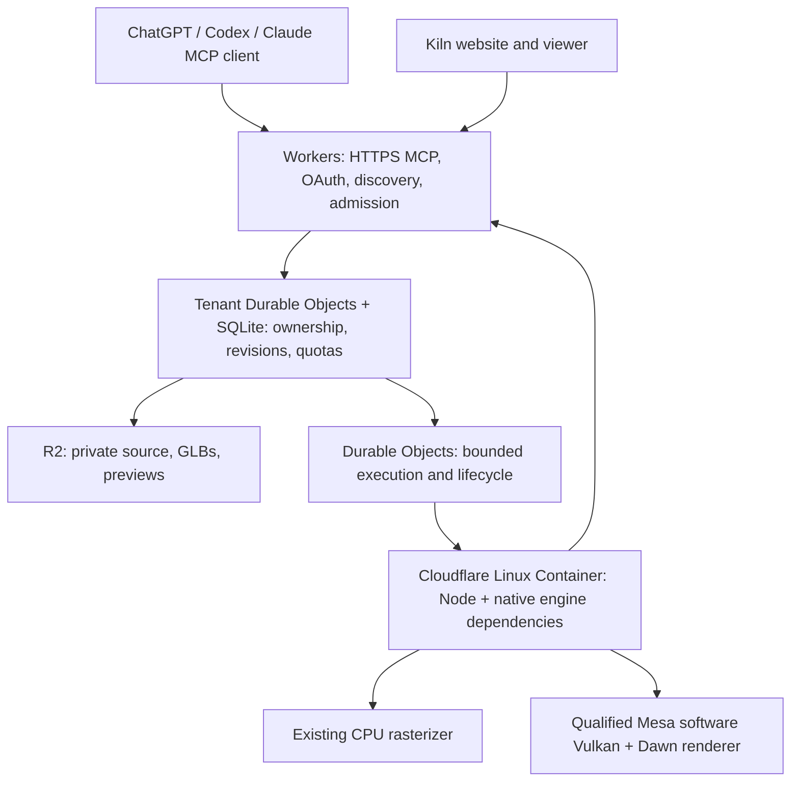

# Kiln 1.0 hosting economics

Research date: 6 October 2026. Companion to the [v1 publication plan](2026-10-05-v1-publication-plan.md).
These are calculated scenarios, not measured Cloudflare performance or an invoice forecast.
No paid Cloudflare deployment, DNS change, sponsorship application or account upgrade
was performed. The existing, separately authorized private Sites probe remains active.

## Owner direction

The owner clarified that **$20/month is an initial target, not a hard ceiling**.
Choose an efficient host and allow deliberate growth. Avoid drifting into hundreds
of dollars of recurring costs without revenue, sponsorship or an explicit funding
decision. The owner already has Cloudflare and ChatGPT Pro. On 6 October the owner
adopted the all-Cloudflare production stack described below; actual runtime and cost
qualification remain implementation work. Sites may complement it if verified benefits justify
the extra integration. No automatic move to Google Cloud Run is planned.

The owner subsequently confirmed free hosted access within quotas with optional
sponsorship and no end-user subscription billing in v1. They accept justified usage
overages and are open to a suitable paid Cloudflare plan. Use Workers Paid
(currently a $5/month account subscription with included allowances), plus metered
Containers/storage and other overages. This is separate from a domain's Pro/Business
plan. The signed-in dashboard now confirms Workers Paid and R2 Paid are already
active, renewing 20 October 2026; no purchase or upgrade was needed. The observed
cycle has $0.00 in usage charges beyond included allowances, excluding the base
subscription. Existing applications share those allowances. Keep the $5 base in
the standalone service scenarios below, but do not count another $5 subscription
as an incremental Kiln charge on this same account. Prepare the bounded compute
trial estimate before deployment. Sources and rates are below.

## What actually costs money

### Recommended implementation: all Cloudflare



The whole diagram can reside under Cloudflare. **Containers are the native compute
service; Workers and Sites are not substitutes for it.** Cloudflare documents Linux
images, native tools and child processes as a [Container use case](https://developers.cloudflare.com/sandbox/concepts/).
Bake the exact Node bundle and native libraries into a pinned Linux image; install
nothing from user input at job time. Serve the web viewer with Workers static assets.

Implementation refinement: tenant ownership and quota transactions now use the
tenant Durable Object's own SQLite database. This keeps the authoritative record
with the tenant routing boundary; it does not need a second D1 copy of those records.
D1 remains optional for a demonstrated shared-metadata need, not a resource to
provision merely because it appeared in the initial diagram.

Native execution does not require hardware GPU rendering. CPU geometry previews
already exist in Kiln. Textured/material previews would use the repo's existing
software Vulkan path, which runs graphics code on the CPU. Current Container types
list CPU, RAM and disk, with no GPU configuration in the verified documentation.
Therefore this plan assumes CPU-only Cloudflare compute, not Workers AI GPUs usable
as a Vulkan device. If hardware rendering becomes necessary, retain `PbrRenderPort`
and attach a separately priced, qualified GPU service only for view production.

Use an isolated Container sandbox per trust boundary, with a short bounded lifetime.
Do not share one unrestricted Linux process/filesystem across tenants. Cloudflare's
[sandbox security guidance](https://developers.cloudflare.com/sandbox/concepts/security/)
explicitly says processes inside a sandbox share access and that a Linux username is
not an isolation boundary. Keep OAuth tokens, R2 credentials and other users' files
in the trusted Worker. Apply outbound network restrictions outside the sandbox.
The Worker remains authoritative for ownership, quotas and permitted output handling.

The critical spike is whether Kiln's current `setpriv`/`bwrap`/namespace restrictions
work inside the actual Container. Native binary support alone does not prove this.
If they do not, qualify an explicit per-job sandbox adapter; do not silently weaken
the current evaluator. Test filesystem escape, network denial, CPU/native-memory
limits, cancellation and tenant separation along with rendering. Treat Container
outputs as untrusted inputs at the host boundary. A successful local Docker run or
existing software-renderer CI job is insufficient to accept hosted isolation.

Start with `standard-2` as a conservative test fixture, then measure a custom
one-vCPU/3-GiB configuration if RSS and image size permit. Current
[custom instance constraints](https://developers.cloudflare.com/containers/platform/limits/)
allow sizing within documented CPU/memory/disk limits. The tables below retain
6 GiB for a reproducible conservative comparison; they do not claim optimized sizing.

### When another compute host could be better

| Candidate | Why consider it | Price evidence and limitation |
| --- | --- | --- |
| Cloudflare Workers + Containers + R2 | Preferred first candidate for intermittent work, integrated operations and scale-to-zero | Usage scenarios below; native isolation/software rendering still need provider tests |
| Cloudflare edge/storage + a Linux VM | Predictable compute bill if usage keeps a machine busy, or if Container isolation is incompatible | DigitalOcean Basic 8 GiB/4 shared vCPU is $48/month; CPU-Optimized 8 GiB/4 dedicated vCPU is $84/month, before the edge/storage and extras |
| Hetzner Linux VM + Cloudflare edge/storage | Lower fixed-cost candidate when regional latency and capacity are acceptable | June 2026 official schedule lists EU CX33 at $9.99/month and CPX32 at $41.99, excluding IPv4/tax; instance capacity/availability must be checked, not inferred from a stale low-price advertisement |
| Sites Pro + external Container/VM | Managed frontend/identity convenience | Cannot remove native compute cost; Pro hosting allowance and public-plugin route remain insufficiently quantified |

Sources: [DigitalOcean pricing](https://www.digitalocean.com/pricing/droplets),
[Hetzner current price-adjustment schedule](https://docs.hetzner.com/general/infrastructure-and-availability/price-adjustment/),
[Hetzner cost-optimized specifications](https://www.hetzner.com/cloud/cost-optimized/).
Both cited Hetzner models have 8 GB memory; the public product pages returned
unavailable markers during this read, so checkout capacity is unverified. Do not
select a launch dependency on that basis. A shared vCPU is not equivalent to dedicated
capacity, and an 8-GB VM does not prove four simultaneous 6-GiB Kiln jobs will fit.

For perspective, one DigitalOcean Basic VM plus the modeled Cloudflare base and
100 GB R2 is about $54.35/month before backups/tax. It does not guarantee the same
throughput, isolation or availability as an elastic fleet. A VM requires patching,
process supervision, isolation, backups and recovery. Compare measured completed
work per dollar, not nominal vCPU counts. Cloud Run remains an evidence-backed
exception candidate rather than an automatic next step.

The recommendation is to qualify the all-Cloudflare stack first. Revisit a fixed VM
when measurements show steady utilization or roughly $50-$100/month of compute.
Keep the Linux job interface portable so replacing compute does not require moving
the domain, OAuth service, stored assets, npm package or plugin identity.

An installed MCP connection is not a dedicated Kiln machine. Keep discovery,
authentication, artifact listings and downloads at the edge; admit isolated engine
jobs only when a tool needs evaluation, export or rendering. Persist assets outside
the compute instance and stop compute between work when practical.

This model assumes the user's ChatGPT/Claude session writes source and calls tools.
Kiln does not invoke a maintainer-funded model. If a hosted native agent loop, image
generation or texture API is added, price that separately. The owner's Pro plan must
not be treated as pooled model credits for public users.

Current Cloudflare rates used in the calculations:

| Component | Included monthly amount | Overage assumption |
| --- | --- | --- |
| Workers Paid | $5 account subscription; 10M requests; 30M CPU-ms | $0.30/M requests; $0.02/M CPU-ms |
| Container CPU | 22,500 vCPU-seconds | $0.000020/vCPU-second |
| Container memory | 90,000 GiB-seconds | $0.0000025/GiB-second |
| Container disk | 720,000 GB-seconds | $0.00000007/GB-second |
| R2 Standard | 10 GB-month; 1M writes/Class A; 10M reads/Class B | $0.015/GB-month; $4.50/M Class A; $0.36/M Class B |
| Durable Objects compute | 1M requests; 400,000 GB-seconds | $0.15/M requests; $12.50/M GB-seconds |
| Durable Objects SQLite | 25B rows read; 50M rows written; 5 GB-month | $0.001/M rows read; $1/M rows written; $0.20/GB-month |

Sources: [Workers](https://developers.cloudflare.com/workers/platform/pricing/),
[Containers](https://developers.cloudflare.com/containers/platform/pricing/),
[R2](https://developers.cloudflare.com/r2/pricing/),
[Durable Objects](https://developers.cloudflare.com/durable-objects/platform/pricing/).
Containers charge allocated memory/disk while awake and actual CPU usage; sleep
stops container compute billing. R2 internet egress is free, but container egress has
its own allowance. DO duration and R2 operations have billing-unit rounding, included
below. All allowances are account-level assumptions, not newly granted per project.

The modeled instance is `standard-2`: one vCPU, 6 GiB RAM, 12 GB disk. This is a sizing
assumption carried from the hosting research, not evidence that Kiln needs 6 GiB or
that a smaller instance works. A lower-memory qualified instance could cost less.
Workers Paid is separate from a domain's Pro/Business zone plan; do not purchase a
zone upgrade without a feature that requires it.

## Usage scenarios

One session means an asset-authoring visit, potentially containing repeated edits
and reviews. A compute job means one evaluation/render/export invocation, not one
finished asset. Failures, retries and revisions count as work too.

| Assumption per monthly active user | Occasional author | Frequent author |
| --- | --- | --- |
| Authoring sessions/month | 4 | 20 |
| Compute jobs/session | 10 | 20 |
| Compute jobs/month | 40 | 400 |
| CPU and busy wall time/job | 5 seconds each | 15 seconds each |
| Extra awake time/session, including startup and idle gaps | 60 seconds | 60 seconds |
| Extra CPU/session for startup | 2 vCPU-seconds | 2 vCPU-seconds |
| Average retained source/GLB/preview storage | 100 MB | 100 MB |

These inputs are hypotheses for sensitivity analysis. The 60-second overhead is the
total extra awake time across the session, not a promised cold-start time or a
five-minute timeout on each tool call. It requires checkpointing and sensible sleep
behavior; retaining a container throughout model thinking can cost substantially more.
The 100 MB storage assumption is neither an adopted quota nor a measured asset size.

| Monthly active users | Occasional jobs/month | Occasional modeled USD/month | Frequent jobs/month | Frequent modeled USD/month |
| ---: | ---: | ---: | ---: | ---: |
| 100 | 4,000 | $5.44 | 40,000 | $27.76 |
| 500 | 20,000 | $10.44 | 200,000 | $134.80 |
| 1,000 | 40,000 | $16.75 | 400,000 | $257.47 |
| 5,000 | 200,000 | $67.27 | 2,000,000 | $1,311.56 |

These columns are two workload scenarios, not confidence bounds. A real population
will mix light and heavy users; a small group of intensive users can dominate usage.
For example, 1,000 users at the occasional workload, with 10% upgraded to the frequent
workload, produces approximately $40/month under the same assumptions.

The table includes the $5 subscription, compute, storage and the modeled request,
log and network overages. It assumes otherwise unused included allowances, compact
metadata within included D1/DO SQL allowances, downloads served from R2, and no
paid identity provider. It excludes tax, existing domain renewal, the already-owned
Pro subscription, engineering/support, backup copies and unmodeled abuse/retries.
Allow operational headroom rather than spending to the calculated cent. Do not count
the full account allowances again if other projects already consume them.

At 1,000 occasional users, the calculation breaks down to $5 subscription, $3.71
CPU, $6.38 memory, $0.32 disk and $1.35 R2 storage. Other modeled usage remains within
its included amounts. This suggests an initial community deployment can plausibly
live near the $20 target, **if the actual job and idle measurements match**.

## Idle time, storage and concurrency change the answer

For the same 1,000 occasional users and 40,000 jobs:

| Total extra awake time per session | Modeled monthly cost |
| --- | ---: |
| 0 seconds, optimistic lower-overhead case | $12.95 |
| 60 seconds | $16.75 |
| 5 minutes | $31.96 |
| 15 minutes | $82.48 |

An otherwise idle `standard-2` instance kept awake for all 720 hours of a 30-day month
costs about $45.78 including the base subscription and provisioned memory/disk,
before storage or background CPU. Fully occupying its CPU raises that to about
$97.17. Therefore, do not buy an always-warm machine implicitly through idle policy.
The existing local renderer's five-minute lifecycle is not automatically the right
hosted policy. Never shorten it by changing the shared engine contract globally;
implement and qualify the host's lifecycle separately.

Storage depends on all retained accounts, including inactive users. R2 Standard at
100 GB-month is $1.35; at 1,000 GB-month it is $14.85. Saved assets remain until deleted
within quotas, so storage can accumulate across months. Unsaved work expires after
seven days. The table assumes a bounded total stock, not unlimited history.

Do not assign a container or permanently active DO to every connected user. Current
Cloudflare [MCP handler APIs](https://developers.cloudflare.com/agents/model-context-protocol/apis/handler-api/)
support stateless request handling. Qualify it against the required clients, keeping
user state in durable storage and respecting transport compatibility. Container
coordination can still use DOs without making every MCP connection a running server.

Monthly affordability is not burst capacity. The occasional 1,000-user scenario has
about 122 aggregate container-hours/month; the frequent case has 2,000 hours, already
requiring more than two continuously utilized instances on average. Peaks require
more instances or a queue. A single serial five-second job slot serves at most twelve
jobs/minute before overhead. Admission/concurrency limits must deliver an honest
busy/retry result; price and test bursts separately from monthly totals.

## Reproducible calculation

Let `U` be active users; `S` sessions/user; `J` jobs/session; `c` CPU seconds/job;
`w` busy seconds/job; `h` extra awake seconds/session; `i` startup CPU/session.

```text
jobs = U*S*J
cpuSeconds = jobs*c + U*S*i
awakeSeconds = jobs*w + U*S*h
container = max(0,cpuSeconds-22500)*0.000020
          + max(0,6*awakeSeconds-90000)*0.0000025
          + max(0,12*awakeSeconds-720000)*0.00000007
```

Sum awake seconds across instances; overlapping jobs cannot be counted as parallel
single-vCPU throughput for free. The table assumes serial execution within each
instance. The DO estimate conservatively budgets active time equal to instance
awake time at 0.128 GB per DO, then subtracts 400,000 GB-s and rounds any remainder
up to million-GB-s billing blocks. Extra active session/admission DO time must be
added if the architecture introduces it.

Additional explicit assumptions in the reproducible model:

- Worker requests: five/job, twenty/session, twenty/user; five CPU-ms/request.
- DO requests: two/job, one/session, one/user, rounded in excess-million blocks.
- R2: four Class A operations/job and ten Class B operations/job; average storage
  `0.1*U` GB-month, rounded per published billing units. Add inactive users separately.
- Container egress: 1 MB/job in North America/Europe; subtract 1,000 GB/month, then
  $0.025/GB. Downloads come from R2; do not regenerate/re-serve GLBs from compute.
- Logs: five events/job plus one/Worker request. The current included 20M events and
  $0.60/M excess are used; reprice for the announced 1 December 2026 pricing change.
- D1/DO SQL: assume indexed compact metadata below included storage/read/write
  allowances. Polling and full-table scans must be measured before relying on this.

## Sites with the owner's existing Pro subscription

The [current Sites documentation](https://learn.chatgpt.com/docs/sites) confirms Pro
availability, custom domains/subdomains, D1/R2, sign-in and plan-specific limits.
It does **not** publish a numerical Pro allowance for requests/CPU or an overage
price table. Hitting a limit can restrict storage or continued public hosting.
Do not translate Pro's model rate-limit multipliers into hosting capacity, and do not
interpret “no fixed” R2 storage limit as unlimited included usage.

Read-only account checks on 6 October confirmed the existing probe is active,
owner-private and MCP-ready, with no custom domains attached. Its settings UI exposes
**Add custom domain**, so custom-domain configuration is available to this account.
`kiln.instruktlabs.com` is therefore a supported type of target, subject to DNS and
TLS verification. No domain was attached and no DNS records changed. Site settings
did not expose a numerical hosting quota or cost estimate. The account's Usage view
showed model/Work/Codex usage categories, not a Sites hosting meter; those balances
were not used as hosting capacity. Pro was also visible in the account menu.

Treat already-paid Pro as a sunk subscription in the incremental comparison. Sites
might add no separate hosting charge within its allowance, but that is a conditional
scenario, not a verified unlimited-price promise. A complete Sites cost forecast
remains unavailable until account-specific limits and paid expansion terms are visible.

Sites remains a Worker runtime, so current Kiln native modules, subprocess isolation
and software Vulkan still require external Linux compute. A Sites + Cloudflare
Containers hybrid retains the Cloudflare paid compute subscription and most of the
costs above. At the occasional scenario's scale, the Cloudflare gateway already fits
inside its included requests, so replacing it with Sites produces no modeled gateway
savings. Sites could still offer valuable managed identity or UI convenience.

Public Site access, public MCP authorization and public plugin-directory distribution
remain separate qualifications. The earlier managed-plugin install was not completed.
For a custom domain, test OAuth discovery, issuer/resource matching, redirects and
client reconnection on the actual hostname, rather than assuming the existing
`chatgpt.site` OAuth resource changes automatically.

## Sponsorship and credits

1. **GitHub Sponsors under Instrukt Labs** is the most direct recurring hosting-fund
   option. [GitHub supports organizations receiving sponsorships](https://docs.github.com/en/sponsors/receiving-sponsorships-through-github-sponsors/about-github-sponsors-for-open-source-contributors).
   Personal-account sponsorships carry no GitHub fee; organization sponsorships have
   different fees. Illustratively, ten $5 monthly individual sponsors fund $50 gross,
   enough to make modest growth easier to support. Revenue is zero in the base model
   until actually committed; do not promise paid service entitlements for donations.
2. **Cloudflare for Startups** currently advertises a $10,000 entry tier for
   bootstrapped/self-funded companies, with one-year credits and eligibility review.
   [The current page](https://www.cloudflare.com/startups/) also has potentially
   conflicting general “funded within the last 12 months” wording. Verify eligibility,
   legal entity facts and explicit Containers coverage before counting credits.
   Instrukt Labs may be a candidate, not an established accepted applicant. Credits
   expire and overages can be billed. Evaluate steady-state economics without them.
3. **Project Alexandria**, which the old OSS sponsorship link now redirects to,
   offers annual OSS credits. It requires a recognized OSS license and operation
   solely on a non-profit basis. The LLC/open-source combination does not establish
   that condition; obtain provider clarification before treating this as suitable.
   [Current program terms](https://www.cloudflare.com/lp/project-alexandria/).

Research and prepare an application packet during the cycle, but do not make grants
a release dependency. Include the public repo, license, verified usage, monthly cost
model, requested products and benefit to users. No applications or outreach sent.

## Recommendation and qualification gate

Proceed with Cloudflare Workers + bounded Linux Containers + R2 as the preferred
candidate. Preserve portable compute and keep Sites as a bounded integration option.
There is currently no evidence that Sites removes the expensive part of this workload.

Proposed operating policy, to set after measurements: begin near $20, notify/review
when the run rate approaches $30-$50, and require a funding/capacity decision before
planning sustained $100+ months. These thresholds are recommendations, not owner-set
caps or authorization for spend. Track gross infrastructure cost, confirmed recurring
sponsorship, credits and out-of-pocket cost separately. Avoid building subscription
billing into v1 solely because future growth might need funding.

[Cloudflare budget alerts](https://developers.cloudflare.com/billing/manage/budget-alerts/)
are informational and do not stop billing. Add a global admission budget, per-user
limits, bounded job time/memory, maximum instances, idle shutdown, storage quotas,
log controls and an operator compute-stop control. A rejected request or retained
storage can still cost money; this is expenditure control, not a guaranteed invoice cap.

The hosted spike must replace assumptions with measurements of representative CPU
and material-preview jobs: CPU-seconds, RSS, cold startup, aggregate awake time,
cancel/retry rates, output sizes, storage operations and peak queue latency. Reconcile
those with the provider's metering and the account's already-used allowances. Recompute
both usage profiles, a mixed population, and burst behavior before opening access.

## CLI choice and local probe

Use the official [Cloudflare CLI, `cf`](https://developers.cloudflare.com/cf/), pinned
in the new hosting project if qualification succeeds. It is currently beta. On this
Windows machine, `cf@1.0.0-beta.12 --version` and the offline command search for
container applications passed from an isolated scratch install. The initial `npx`
attempt failed because a cache package file was missing; a project-local install
with lifecycle scripts disabled succeeded. No login, deployment or global install
was performed.

Keep Wrangler for existing deployment scripts and beta gaps. The
[migration guide](https://developers.cloudflare.com/cf/wrangler/migrate/) requires
manual attention for Containers and DO migrations; preview changes with dry-run.
Do not run automatic project setup/migration over the existing website during this
research. `cf` has separate authentication, requires Node 22.18+ for configuration,
and does not make current Wrangler configuration interchangeable automatically.

Scratch CLI receipt location:
`C:/Users/Mattm/X/kiln-dogfood/cf-cli-probe-2026-10-06/`.

## OAuth storage addition during implementation

The hosted OAuth gateway uses a dedicated Workers KV namespace for the maintained
Cloudflare OAuth library. This stays within the selected provider; user sources
and assets retain their separate storage boundary. It does not require another
subscription beyond the existing Workers Paid plan.

Rechecked [KV pricing](https://developers.cloudflare.com/kv/platform/pricing/)
on 6 October: Paid includes 10 million key reads per month, one million each of
writes, deletes and list requests, and 1 GB stored. Overage is $0.50 per million
reads, $5 per million writes/deletes/list requests, and $0.50 per GB-month.
Account-wide existing usage consumes those same allowances. Failed lookups are
billable reads, so anonymous token/registration abuse still needs admission controls.

At modest initial use, authentication can fit within the included allowance; this
is a planning inference, not measured usage. The live qualification must count
operations across sign-in, MCP requests, refresh, revocation and expired-record
cleanup and include them in the complete bill. The prototype keeps access tokens
to 15 minutes and refresh grants to 30 days, with library-managed record expiry.
Production KV propagation and account-wide usage remain unqualified.

## Tenant-storage implementation costs

The separate tenant Worker adds SQLite ownership/quota records, R2 object writes,
downloads and bounded retention/reconciliation alarms. The SQLite rates above were
rechecked on 6 October against [Cloudflare pricing](https://developers.cloudflare.com/durable-objects/platform/pricing/).
Indexes and deletes count toward writes; setting an alarm also counts as a write.
This is SQLite-backed Durable Object pricing, not legacy DO key-value pricing.

Daily reconciliation costs persist for a tenant after ordinary artifact deletion.
For 1,000 retained tenants with at most 100 R2 objects each, one daily listing per
tenant is about 30,000 monthly Class A calls and 30,000 alarm invocations, before
uploads, deletion retries, larger prefixes and other operations. The R2 list portion
alone is $0.135 at marginal overage rates before provider rounding, or consumes
included allowance when available. This is arithmetic, not measured provider usage.
Account deletion must finish cleanup and retire alarms to end that recurring work.

The byte quota includes file bytes and serialized saved metadata, but is not a
physical SQLite/R2 invoice ceiling. Measure database/index overhead, transaction
row counts, orphan recovery and DO duration with realistic retained inventories.
Native job costs still dominate the earlier scenarios; these new storage operations
must be included before treating any scenario as a launch forecast.
